# Landing in Irvine: A Fall Field Guide——from debit cards and surf lessons to Swervedriver

<svg class="marg-ic" viewBox="0 0 24 24" aria-hidden="true"><circle cx="12" cy="12" r="9" fill="none" stroke="currentColor" stroke-width="2"/><path d="M3 12h18M12 3c2.8 2.6 4.2 5.6 4.2 9s-1.4 6.4-4.2 9c-2.8-2.6-4.2-5.6-4.2-9S9.2 5.6 12 3Z" fill="none" stroke="currentColor" stroke-width="2"/></svg> Language / 语言：[中文](025-irvine-landing-fall-guide.zh.md) · **English**

<svg class="marg-ic" viewBox="0 0 24 24" aria-hidden="true"><rect x="4" y="5.5" width="16" height="15" rx="2" fill="none" stroke="currentColor" stroke-width="2"/><path d="M4 10h16" stroke="currentColor" stroke-width="2"/><path d="M8.5 3.5v4M15.5 3.5v4" stroke="currentColor" stroke-width="2" stroke-linecap="round"/><circle cx="12" cy="14.7" r="1.7" class="acc-dot"/></svg> 2026-09-11<svg class="marg-ic" viewBox="0 0 24 24" aria-hidden="true"><path d="M4 5.5A1.5 1.5 0 0 1 5.5 4h6.1c.4 0 .78.16 1.06.44l7 7a1.5 1.5 0 0 1 0 2.12l-6.1 6.1a1.5 1.5 0 0 1-2.12 0l-7-7A1.5 1.5 0 0 1 4 11.48V5.5Z" fill="none" stroke="currentColor" stroke-width="2"/><circle cx="8.7" cy="8.7" r="1.4" class="acc-dot"/></svg> landing-guide(落地与秋季生活调研)<svg class="marg-ic" viewBox="0 0 24 24" aria-hidden="true"><path d="M12 5v14M5.85 8.5l12.3 7M18.15 8.5l-12.3 7" class="acc" stroke-width="2.4" stroke-linecap="round" fill="none"/></svg> issue #55

Provenance（来源与元数据）
<table><tr><td>id</td><td>marginalia-025</td></tr><tr><td>title</td><td>Landing in Irvine: A Fall Field Guide——from debit cards and surf lessons to Swervedriver</td></tr><tr><td>date</td><td>2026-09-11</td></tr><tr><td>published</td><td>2026-09-11</td></tr><tr><td>kind</td><td>landing-guide(落地与秋季生活调研)</td></tr><tr><td>issue</td><td>55</td></tr></table>

> A landing handbook and a weekend field guide in one. Land 9/15, classes 9/24, finals end 12/11 — one full autumn, just enough to clear the "newcomer quests" and work through OC and LA's live-music map. How to use this note: **do only three things in week one (§1), explore along the weekend radius (§2), buy tickets off the gig table (§3), and spend the gaps at free museums, surf lessons and campus sports (§4–5). Save your energy for October (§6).** Every price and date links to an official source. Each place carries its 🚗 driving / 🚲 biking distance & time inline (computed per-route with OSRM, rescanned daily at 6am by a script — see §7); rideshare fares are estimate ranges.

## 1. Week One: Only Three Things Really Matter

Land Monday 9/15, classes Thursday 9/24 — nine days in between. With a calendar in hand, the time-sensitive items are just these three:

**① Bank account.** Both Bank of America and Chase open accounts **without an SSN, but only in person** — online applications are auto-rejected. Bring: passport, signed I-20, [printed I-94](https://i94.cbp.dhs.gov/), proof of US address (the apartment lease works), a secondary ID, and $25–100 cash.

| | [Chase College Checking](https://personal.chase.com/personal-banking/checking/chase-college-checking-account) | [BOA Advantage SafeBalance](https://www.bankofamerica.com/deposits/checking/advantage-bank-accounts/) |
|---|---|---|
| Monthly fee | **$0** (ages 17–24, waived up to 5 yrs while enrolled) | $4.95 (waived for students under 25) |
| Tax ID | No SSN needed (in branch) | Officially takes **two IDs + a tax ID** — a Chinese national ID works as FTIN |
| Best for | ≤24 | >24 |

BOA's [international-student page](https://info.bankofamerica.com/en/international/student-bank-account) has the clearest checklist ("You'll need to provide both a foreign and U.S. address, as well as two forms of ID and a tax identification number"); this [2026 student guide](https://usastudentguide.com/blog/best-bank-accounts-international-students-no-ssn/) covers the practical details. Also open a [Wise](https://wise.com/us/) account before landing to receive money from home, then set up Zelle.

**② Transit.** UCI negotiates a rate with OCTA: "**University Passes are only $169** … unlimited regular service on OCTA buses" — $169 per year, county-wide ([UCI Transportation](https://parking.uci.edu/st/bus-shuttle/)), bought via myCommute; routes 59/79/167/178/473 serve campus. The fun part: **Route 1** ([official timetable](https://octa.net/ebusbook/RoutePDFnew/Route001.pdf)) runs the full PCH coast from Long Beach to San Clemente, stopping at Huntington Beach Pier, Newport and Crystal Cove — **one U-Pass covers every beach day**. On campus, the free Anteater Express shuttle; to LA, the [Pacific Surfliner](https://www.pacificsurfliner.com/plan-your-trip/tickets-and-fares/) runs Irvine→Union Station 13× daily from $19.

**③ SSN & CA ID (not urgent, but know the trigger).** F-1 students **cannot get an SSN without on-campus employment**; once hired as RA/TA, first get a Social Security Student Verification Letter from the hiring department ([IC handbook](https://bpb-us-e2.wpmucdn.com/sites.uci.edu/dist/4/5424/files/2026/02/IC_Student_Handbook_2026-27.pdf)), then visit the SSA office in Santa Ana. A California Real ID is worth it even without driving ([DMV](https://www.dmv.ca.gov/portal/driver-licenses-identification-cards/real-id/what-is-real-id/)); without an SSN you need an SSA "ineligibility letter" first.

Timeline: 9/15 land → 9/16-17 print I-94, walk into a bank → 9/18 IC welcome picnic, **downy show at night (§3)** → 9/19-20 Crystal Cove / Tanaka Farms buffer → 9/21-25 Welcome Week (**Tue 9/22, 11:00-16:00, [Anteater Involvement Fair](https://campusorgs.uci.edu/signature-programs-events/fall-quarter/anteater-involvement-fair/), Aldrich Park**) → 9/24 classes → 10/2-4 the first triple-header weekend (§6).

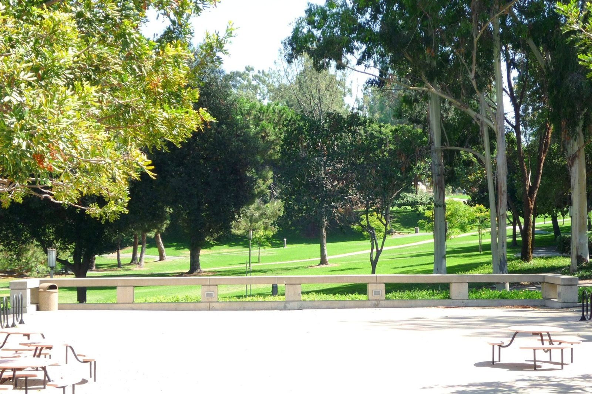
*Aldrich Park, the green heart of UCI — home of Welcome Week and the Involvement Fair. Photo: Mikejuinwind123, CC BY-SA 3.0, via Wikimedia Commons*

## 2. The Weekend Radius: Beaches and an Art District

Living in 92617 means the ocean is a 20-minute problem in every direction. Each place below lists 🚗 driving / 🚲 biking from Palo Verde:

- **[Huntington Beach](https://en.wikipedia.org/wiki/Huntington_Beach,_California)** (🚗 12 mi / 21 min · 🚲 11 mi / 73 min): winter swells from the North Pacific and summer swells from the Southern Hemisphere both "focus on Huntington Beach, **creating consistent surf all year long**, hence the nickname 'Surf City'" — the beginner-surfing battleground (§5);
- **[Laguna Beach](https://en.wikipedia.org/wiki/Laguna_Beach,_California)** (🚗 12 mi / 20 min · 🚲 14 mi / 75 min): "seaside resort city … mild year-round climate, scenic coves" — an art town of galleries and monthly art walks, best after the summer crowds leave;
- **[Crystal Cove](https://en.wikipedia.org/wiki/Crystal_Cove_State_Park)** (🚗 7 mi / 13 min · 🚲 6 mi / 42 min): 3.2 miles of coastline plus 2,400 acres of canyons — beach, tide pools and ridge hikes in one park;
- **[Newport Beach](https://en.wikipedia.org/wiki/Newport_Beach,_California)** (🚗 8 mi / 16 min · 🚲 7 mi / 52 min): harbor + Balboa Island ferry; hosts the December boat parade (§6);
- **[Downtown Santa Ana](https://en.wikipedia.org/wiki/Santa_Ana,_California)** (🚗 9 mi / 17 min · 🚲 8 mi / 59 min): the county seat, "the face of a new California" per the NYT. Best surprise: [**DTSA Art Walk**](https://dtsaartwalk.org/) — "free, all-ages … **5pm-10pm on every First Saturday** … **a program of The Frida Cinema**": a dozen galleries, outdoor stages and food trucks in one evening.

Biking note: the OC coastal network is flat and well-connected; an e-bike beats the (regular-bike) estimates above, especially along the San Diego Creek line toward Newport and Crystal Cove.

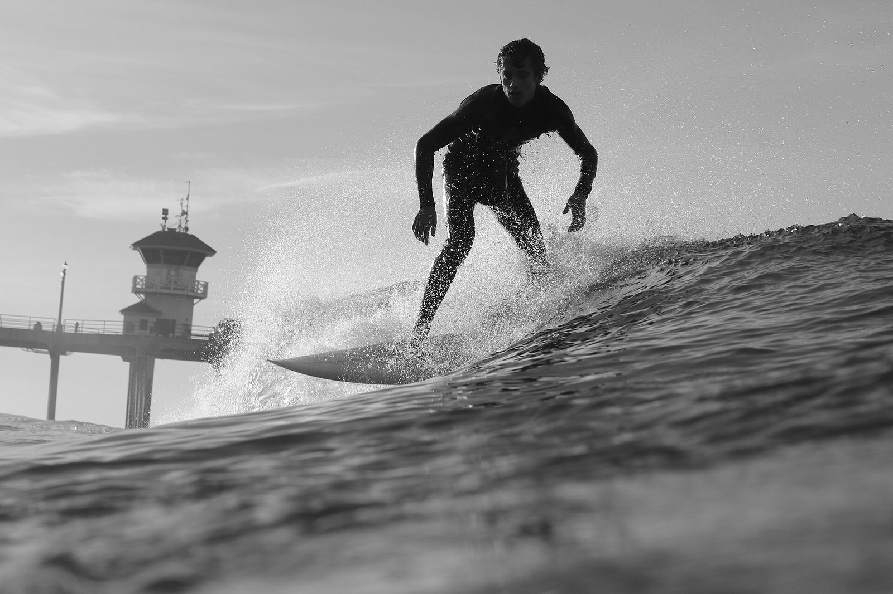
*Daily life under the Huntington Beach Pier. Photo: Jeremy Bishop (Unsplash), CC0, via Wikimedia Commons*

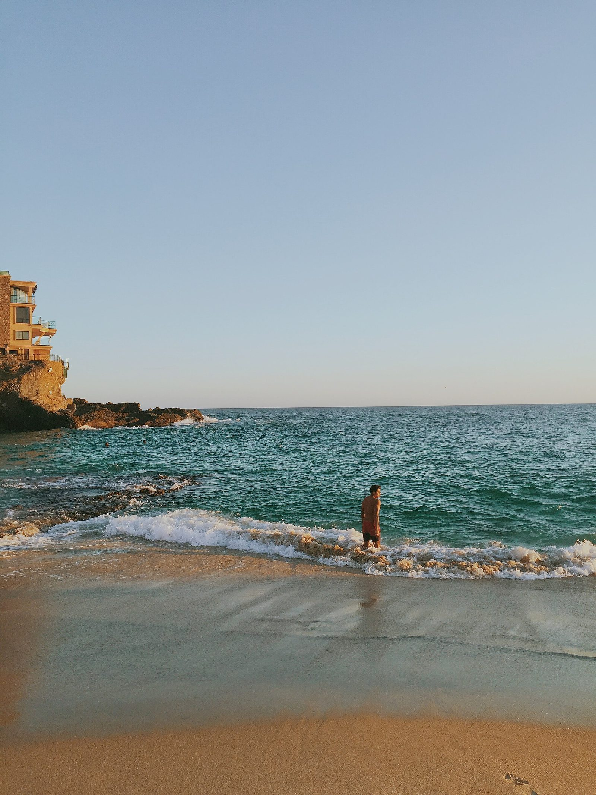
*A Laguna cove at sunset; Sept-Oct has the warmest water of the year. Photo: Kiersten Ramshaw (Unsplash), CC0, via Wikimedia Commons*

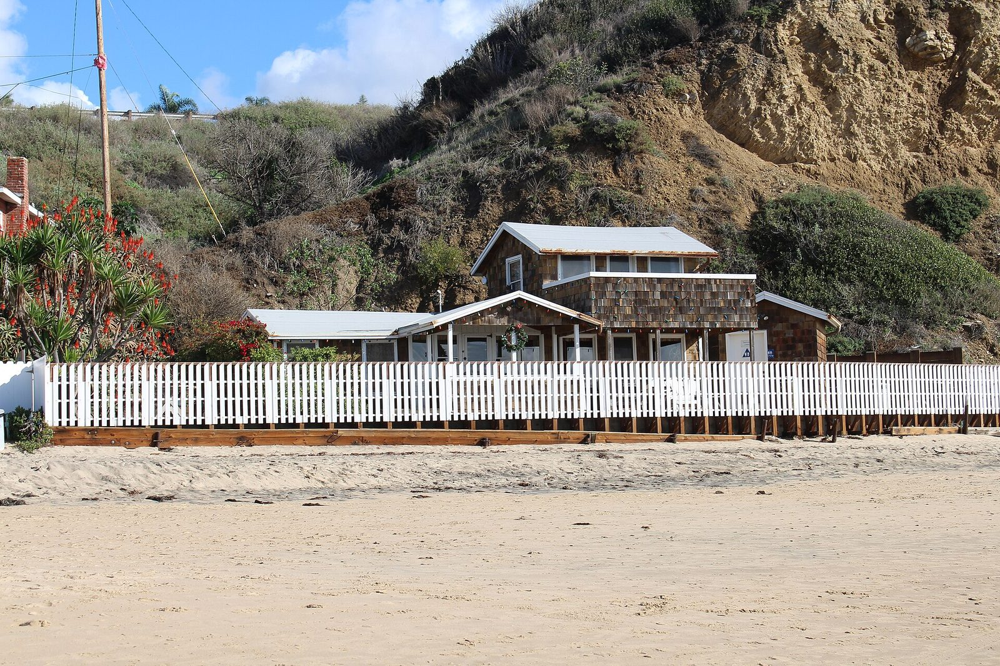
*Crystal Cove Historic District — 1930s beach cottages. Photo: Coolcaesar, CC BY-SA 4.0, via Wikimedia Commons*

## 3. Gigs: Japanese Post-Rock on Day Four

Good news first: **Friday 9/18, day four after landing, [downy](https://dice.fm/event/pynbxl-downy-quiet-fear-band-argument-18th-sep-zebulon-los-angeles-tickets) plays Zebulon in LA** — "widely regarded as **the pioneers of Japanese post-rock** … renowned for dense, explosive live performances" (DICE), $26.78, 21+. The misses are pre-landing: Polyphia played the Palladium on 9/10; Mogwai spends the fall in Europe.

**Confirmed fall shows** (all checked against ticketing pages):

| Date | Show | Venue | Price |
|---|---|---|---|
| 9/18 (Fri) | **downy** (JP) + Quiet Fear | [Zebulon](https://dice.fm/event/pynbxl-downy-quiet-fear-band-argument-18th-sep-zebulon-los-angeles-tickets), LA | $26.78 · 21+ |
| 10/3 (Sat) | [Neverender Festival · Sat](https://www.livenation.com/event/vvG10Z_GNE9WyQ/neverender-festival-single-day-10-3): Coheed and Cambria, Sunny Day Real Estate, Turnover, Destroy Boys, Hail the Sun, Narrow Head | Observatory Festival Grounds, Santa Ana | Sat single-day resale ~$200 all-in |
| 10/4 (Sun) | [Neverender · Sun](https://www.songkick.com/festivals/3791371-neverender-single-day-103/id/43270873-neverender-festival--single-day-103-2026): Circa Survive, Thursday, La Dispute, PUP, **Covet (math rock)**, Slow Mass | same | see LiveNation |
| 10/9 | Deer Tick | [Teragram](https://teragramballroom.com/tm-event/deer-tick/), LA | $30 |
| 10/10 | Soulfly + Nailbomb | [The Wayfarer](https://app.songkick.com/venues/2645573-wayfarer/calendar), Costa Mesa | ~$20 · 21+ |
| 10/15 | **Dinosaur Jr.** + Stef Chura | [HOB Anaheim](https://anaheim.houseofblues.com/shows) | — |
| 10/16-18 | **Stones Throw 30 festival** (Sudan Archives, Mild High Club, Dâm-Funk) | [Lodge Room](https://www.lodgeroomhlp.com/shows/stonesthrow30/), LA | $60/day |
| 10/22 | **Weatherday** (5th-wave emo) | [Lodge Room](https://www.superfan.social/events/weatherday-los-angeles-2026-10-22-1) | — |
| 10/24 | REZN; Saosin 20th anniversary | Zebulon; HOB Anaheim | ~$27 |
| 10/29 | **Taste of Chaos** | HOB Anaheim | — |
| 11/11 | Periphery | HOB Anaheim | — |
| 11/13 | SWMRS | [Teragram](https://teragramballroom.com/tm-event/swmrs/) | $20 |
| 12/5 | Nightmare of You | The Echo | — |
| **12/12** | **Swervedriver** (shoegaze legends) | [Teragram](https://www.songkick.com/concerts/43212432-swervedriver-at-teragram-ballroom) | — |

**Covet (with La Dispute, Thursday, PUP) is Sunday 10/4; Sunny Day Real Estate is Saturday 10/3** — Neverender is Coheed and Cambria's outdoor two-dayer with separate single-day tickets, held in the Observatory parking lot, 7 mi from campus.

**Venue map** (nearest first; 🚗 drive · 🚲 bike · $ rideshare estimate):

| Venue | Where | Character | 🚗 · 🚲 · $ |
|---|---|---|---|
| [The Observatory OC](https://www.observatoryoc.com/shows) | Santa Ana | OC's rock mainstage, 1,000 cap + two small rooms | 🚗 7 mi/12 min · 🚲 6 mi/44 min · $14–20 |
| [The Wayfarer](https://www.wayfarercm.com/calendar) | Costa Mesa | Bar venue, 21+, ~$20 | 🚗 7 mi/13 min · 🚲 7 mi/47 min · $14–20 |
| [House of Blues Anaheim](https://anaheim.houseofblues.com/shows) | Anaheim | Mid-large tours | 🚗 15 mi/23 min · 🚲 13 mi/92 min · $22–34 |
| [Chain Reaction](https://allages.com/) | Anaheim | All-ages DIY institution; self-described "shows reasonably priced, (usually **$8.00 to $20.00 dollars**)" | 🚗 17 mi/24 min · 🚲 15 mi/109 min · $26–38 |
| [The Echo / Echoplex](https://www.theecho.com/shows) | Echo Park, LA | Indie/punk twin rooms | 🚗 44 mi/56 min · 🚲 56 mi/276 min · $60–90 |
| [Zebulon](https://zebulon.la/) | Atwater, LA | "Music venue, café concert, restaurant, screenings" (DoLA) — experimental/math/jazz hub | 🚗 46 mi/59 min · 🚲 58 mi/279 min · $60–90 |
| [Teragram Ballroom](https://teragramballroom.com/) | DTLA | ~600 cap, indie/shoegaze-leaning bookings | 🚗 43 mi/56 min · 🚲 57 mi/267 min · $55–85 |
| [Lodge Room](https://www.lodgeroomhlp.com/) | Highland Park | ~500 cap, the pickiest bookings in town | 🚗 47 mi/63 min · 🚲 57 mi/272 min · $60–90 |

**Tracking** (five minutes a week): [Oh My Rockness](https://losangeles.ohmyrockness.com/), [DICE](https://dice.fm/los-angeles), Songkick/Bandsintown artist alerts, and venue Instagrams — small rooms like Chain Reaction don't use Ticketmaster and announce late.

## 4. Museums, Studio Lots and Cinemas: Do the Free Ones First

LA is kind to broke students because the best institutions are **free**:

- **[Getty Center](https://www.getty.edu/visit/center/)**: free (timed ticket) — "well known for its architecture, gardens, and views overlooking Los Angeles" ([Wikipedia](https://en.wikipedia.org/wiki/Getty_Center)); parking $25, closed Mondays. 🚗 55 mi / 67 min (cycling is not realistic — train + bus instead);
- **The free crowd**: [The Broad](https://www.thebroad.org/visit) (🚗 43 mi / 55 min), [MOCA Grand Ave](https://www.moca.org/) (same block), [Hammer Museum](https://hammer.ucla.edu/), [Griffith Observatory](https://griffithobservatory.org/visit/) (Tue-Fri 12:00-22:00, closed Mon; 🚗 50 mi / 67 min);
- **[LACMA](https://www.lacma.org/visit)**: free for all on the second Tuesday monthly; **free Jazz at LACMA on Friday evenings Apr-Oct**; the Metro D line now stops at its door. 🚗 49 mi / 65 min;
- **Best paid value**: [Academy Museum](https://www.academymuseum.org/en/visit) — **students $15**, $10 after 4:30pm, $10 screenings with frequent Q&As. 🚗 49 mi / 64 min.

**Studio tours** (official prices, ascending): [Sony](https://www.sonypicturesstudiostours.com/) $55 (🚗 44 mi / 54 min) → [Paramount](https://www.paramountstudiotour.com/studio-tours.html) $71 (🚗 48 mi / 62 min) → [Warner Bros.](https://www.wbstudiotour.com/tickets/) from $79 (real filming happens around you; closed Tue-Wed; book 2-4 weeks ahead; 🚗 53 mi / 66 min) → [Universal](https://www.universalstudioshollywood.com/web/en/us/theme-park-ticket-deals) from $109 (park + tram, frequent "2nd day free" deal; 🚗 52 mi / 68 min). First pick: WB.

**Cinemas** — two budget temples: [New Beverly](https://thenewbev.com/) (Tarantino's own: "Repertory **double feature programming since 1978** … All movies are projected on film", **$14 for a 35mm double bill**; 🚗 49 mi / 65 min); and [The Frida Cinema](https://thefridacinema.org/about/) (🚗 9 mi / 17 min · 🚲 8 mi / 59 min):

> "**The Frida Cinema opened on February 21st, 2014 … Screening more than 500 unique films and welcoming more than 100,000 guests each year** … **The Frida Cinema is the only nonprofit independent cinema in Orange County, California.**"

OC's only nonprofit cinema (305 E 4th St, Santa Ana): $12 regular, **$9 students**, $9 matinees, promo code `OCTA` takes another $3 off ([tickets](https://thefridacinema.org/tickets/)). October is the month-long "Art House of Horrors" series, with the 12-hour Camp Frida 9 marathon on 10/18 (from $30). It sits on the same block as the DTSA Art Walk (§2).

**IMAX 70mm alert — *The Odyssey* keeps extending**: per the Hollywood Reporter (9/3), 70mm screenings run **through the end of September**, one of the longest IMAX runs ever. **The closest true 70mm house to campus is Regal Irvine Spectrum 21** (🚗 7.7 mi / 14 min · 🚲 8.6 mi / 44 min from Palo Verde, inside the Spectrum Center mall from the shop list above, free parking; reserved seating — [tickets & seats](https://www.regmovies.com/theatres/regal-irvine-spectrum-screenx-4dx-imax-rpx-vip/cinema-07322)). All five SoCal 70mm houses: Regal Irvine Spectrum · TCL Chinese (Hollywood) · Regal LA Live (DTLA) · AMC CityWalk (Universal) · Regal Edwards Ontario Palace ([in70mm.com list](https://in70mm.com/presents/1970_imax/2026_the_odyssey/engagements/index.htm)); note AMC Orange 30 is an IMAX Laser house and is **not** on this run's 70mm list. Pricing: some premium 70mm seats exceed $30 ([california.com](https://www.california.com/where-to-see-the-odyssey-in-imax-70mm-in-california/)) — Regal typically undercuts AMC/TCL and Spectrum parking is free, so **the cheapest overall option is the one next door**. Daily showtimes are tracked automatically by a workspace script.

**Recommended shops near Irvine** (each row links to Google Maps):

| Shop | Category | Why |
|---|---|---|
| [Design Within Reach](https://www.google.com/maps/search/?api=1&query=Design+Within+Reach+3303+Hyland+Ave+Costa+Mesa) (3303 Hyland Ave C-1, Costa Mesa) | Design furniture | The one you asked about: modern-design flagship with a Dining Test Lab and free design services — inside the SOCO design district |
| [South Coast Collection (SOCO)](https://www.google.com/maps/search/?api=1&query=South+Coast+Collection+Costa+Mesa) | Design district | H.D. Buttercup warehouse-style home emporium + coffee roasters; thrift your furniture setup here first |
| [IKEA Costa Mesa](https://www.google.com/maps/search/?api=1&query=IKEA+Costa+Mesa) | Furniture | First-stop furniture (see entry 016's desk survey) |
| [South Coast Plaza](https://www.google.com/maps/search/?api=1&query=South+Coast+Plaza+Costa+Mesa) | Mall | OC's flagship mall: West Elm, Crate & Barrel, Muji under one roof |
| [Fashion Island](https://www.google.com/maps/search/?api=1&query=Fashion+Island+Newport+Beach) | Open-air mall | Newport sea-breeze shopping; the RH gallery is worth a stop |
| [The Camp & The Lab](https://www.google.com/maps/search/?api=1&query=The+Camp+Costa+Mesa) | Anti-mall | Costa Mesa's indie courtyard: coffee, camping gear, small shops |
| [Irvine Spectrum Center](https://www.google.com/maps/search/?api=1&query=Irvine+Spectrum+Center) | Complex | Closest to campus; Ferris wheel + night lights |
| [Kinokuniya Book Store](https://www.google.com/maps/search/?api=1&query=Kinokuniya+Book+Store+Costa+Mesa) | Books | Japanese art books, magazines, stationery (Costa Mesa) |
| [Fingerprints Music](https://www.google.com/maps/search/?api=1&query=Fingerprints+Music+Long+Beach) | Records | Long Beach vinyl institution; pairs with an LB day trip |
| [Amoeba Music](https://www.google.com/maps/search/?api=1&query=Amoeba+Music+Hollywood) | Records | America's biggest used-record store; on the LA route |
| [Mitsuwa Marketplace](https://www.google.com/maps/search/?api=1&query=Mitsuwa+Marketplace+Irvine) | Japanese grocery | Japanese food + food court (Irvine) |
| [H Mart](https://www.google.com/maps/search/?api=1&query=H+Mart+Irvine) | Korean grocery | Asian staples resupply (Irvine) |
| [Daiso](https://www.google.com/maps/search/?api=1&query=Daiso+Tustin) | Variety store | $1.5-ish Japanese everything, storage/kitchen hacks (Tustin) |
| [Micro Center](https://www.google.com/maps/search/?api=1&query=Micro+Center+Tustin) | Electronics | Brick-and-mortar computer gear, ~15 min away (Tustin) |
| [REI](https://www.google.com/maps/search/?api=1&query=REI+Tustin) | Outdoors | Surf/camping gear; occasional Garage Sales (Tustin) |

## 5. Surfing and Campus Sports: Sept-Oct Has the Warmest Water

Wikipedia explains the "Surf City" nickname: swells from both hemispheres take turns, "creating consistent surf all year long." For beginners the window is **Sept-Oct: warmest water (~19-21°C, a 3/2 wetsuit is enough) and stable southern-hemisphere swell tails**.

- **[Banzai Surf School](https://huntingtonbeachsurfinglessons.com/)** (HB, PCH & Brookhurst; 🚗 12 mi / 21 min · 🚲 11 mi / 74 min): **daily 11AM group lesson $99** — "All lessons include surfboards and good full wetsuits", one instructor per four surfers, and solo sign-ups get upgraded to a private; 2h private $169;
- **[Newport's city-contracted schools](https://www.newportbeachca.gov/government/departments/recreation-senior-services/surf-lessons)** (🚗 8 mi / 16 min): $95/h private;
- **On your own**: board + wetsuit ~$20-40 per half day; beginners head to Doheny State Beach (🚗 17 mi / 24 min · 🚲 16 mi / 85 min) or the south side of the HB Pier.

On campus it's cheaper still: the [ARC gym](https://www.campusrec.uci.edu/membership/) is free for registered students (climbing wall, pool, courts, free gear rental); [group fitness](https://www.campusrec.uci.edu/groupx/) $40-85/quarter.

**ARC's fall activity classes are open for registration** (since 9/8 at [my.campusrec.uci.edu](https://my.campusrec.uci.edu/) with your NetID; classes run ~9/28 to early December; students & ARC members only, prices below are student rates):

| Category | Classes | Student price | Schedule |
|---|---|---|---|
| Swim school | Beginning / Intermediate / Advanced | $50/session | M/W or Tu/Th, 9/28-11/5, evenings |
| Martial arts | BJJ (gi required) · Japanese Karate · Muay Thai (gloves) · Real-World Self-Defense (10 wk) · Iaido | $60-75/session | mostly evenings, 9/28-12/3 |
| Boxing | Boxing · Kickboxing (bring your own gloves) | $50-60/session | Wed evenings / Tu-Th early AM |
| Racquet sports | Tennis Beg/Int · Pickleball Beg/Int | $80/session ($100 non-student) | twice weekly, 9/28-11/19 |
| Dance | Belly Dance · Commercial · Salsa | $60-65/session | Physical Forum, 9/28-12/4 |
| Certification | CPR/AED + First Aid (one-day, 5.5h) | $70 | per session |

Money tip: Campus Rec runs a [Well-being Fee Waiver](https://campusrec.uci.edu/fee-waiver.html) — apply once per quarter for a discount on any class, fitness pass or OA trip; submit at least two weeks before the activity starts.

**OA fall trips** (run by [Outdoor Adventures](https://www.campusrec.uci.edu/outdoor/), transport included, departing from the ARC; overnight trips have pre-trip meetings):

| Date | Trip | Student price |
|---|---|---|
| 9/26-27 (Sat-Sun) | PCT backpack overnight | $45 |
| 10/4 · 10/11 · 10/18 (Sun) | Half-day hikes: Oak Canyon / Bolsa Chica Wetlands / Red Rocks | $8 |
| 10/10 · 10/17 · 11/13 | Full-day summits: Tahquitz Peak / Sitton Peak / Veterans Day Hike | $18 |
| 11/7-8 (Sat-Sun) | Joshua Tree camping | $45 |

Even varsity is discounted — per [UCI Athletics ticketing](https://app.ucirvinesports.com/Studenttickets), undergrads enter free and "**Graduate students can purchase quarterly athletic passes for $33** granting them access to all regular season home events", plus a $5 guest ticket. For hiking company, [Irvine Ranch Conservancy](https://letsgooutside.org/activities/) runs free guided hikes year-round.

## 6. The Calendar: Save Your Energy for October

**September (landing month)**: Old World Oktoberfest (9/12-11/8, HB, free Wed/Thu tickets), [Tanaka Farms pumpkin patch](https://www.tanakafarms.com/pages/the-tanaka-pumpkin) (9/12-11/1), [Knott's Scary Farm](https://www.sixflags.com/knotts/scary-farm-tickets) (from 9/17, $65+; 🚗 19 mi / 30 min), [Halloween Horror Nights](https://www.universalstudioshollywood.com/halloween/) (42 nights 9/3-11/1, $77-107; 🚗 52 mi / 68 min), downy on 9/18, the Involvement Fair on 9/22.

**October** — every month deserves a theme; October's is "don't stay home":

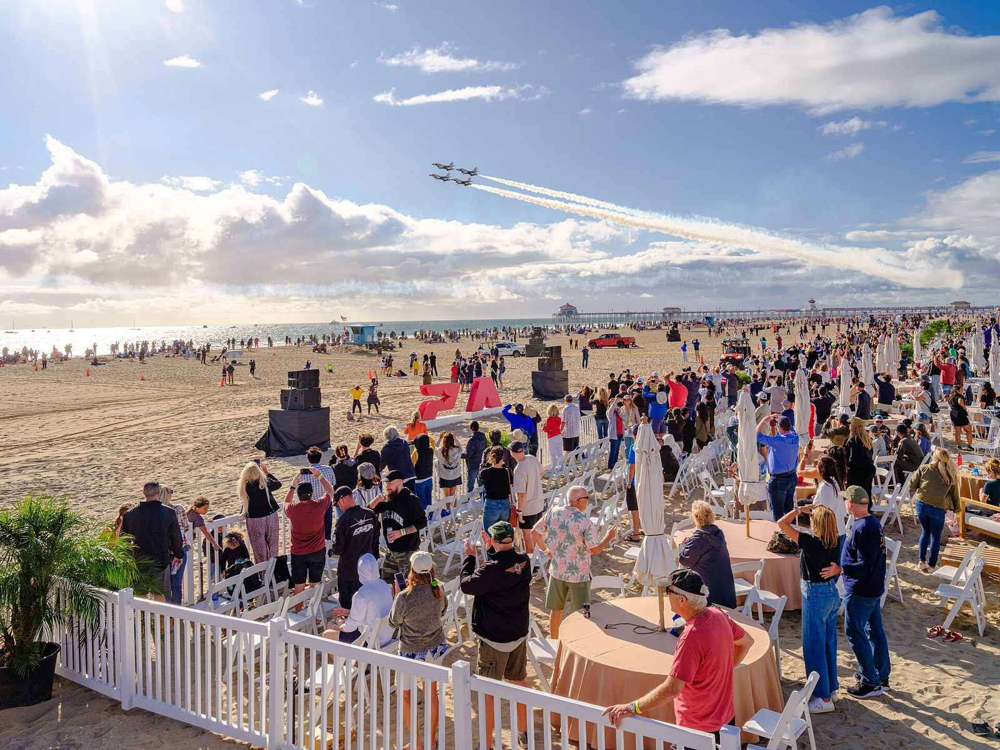
*Pacific Airshow over Huntington Beach — watch free from the sand. Photo: PacificAirshow2024, CC BY 4.0, via Wikimedia Commons*

- **10/2-4 [Pacific Airshow](https://pacificairshowusa.com/faq)** (HB; 🚗 12 mi / 21 min): "Approximately 10:30AM - 4:30PM Daily"; free from the beach;
- **10/3-4 Neverender** (Santa Ana; 🚗 7 mi / 12 min, §3);
- **10/10 [Irvine Global Village Festival](https://www.cityofirvine.gov/irvine-global-village-festival-communications-engagement/about-festival)**: "Orange County's premier multicultural event", 25th anniversary, Great Park, free; 🚗 8 mi / 16 min · 🚲 9 mi / 46 min;
- **10/11 [CicLAvia: Heart of LA](https://ciclavia.org/events/heart-of-la-2026-10/)**: 6.5 miles of car-free streets downtown, 9am-4pm, free — same weekend as Global Village, do both; 🚗 43 mi / 54 min (take Amtrak to Union Station and join by bike);

*CicLAvia: downtown streets become a one-day park. Photo: Eric Garcetti, CC BY 2.0, via Wikimedia Commons*

- **10/15-22 [Newport Beach Film Festival](https://newportbeachfilmfest.com/)**: 300+ films from 50 countries (🚗 8 mi / 16 min);
- **10/16-18 Stones Throw 30; 10/21 [Lakers opener](https://lakers.com/news/lakers-announce-26-27-schedule) vs Warriors; 10/21-25 [AFI FEST](https://www.afi.com/press/american-film-institute-announces-40th-afi-fest-presented-by-canva-to-take-place-october-21-25-2026/)** at the TCL Chinese (🚗 50 mi / 65 min);
- **10/24 [Día de los Muertos @ Hollywood Forever](https://www.ladayofthedead.com/event-info/)**: "NOON – MIDNIGHT", the country's most famous Day of the Dead (🚗 48 mi / 61 min);
- **10/31**: the [WeHo Halloween Carnaval](https://www.visitwesthollywood.com/halloween-carnaval/frequently-asked-questions-halloween-carnaval/) ("free and no tickets are required") or [USC vs Ohio State](https://usctrojans.com/sports/football/schedule/text) at the Coliseum (🚗 43 mi / 55 min).

*A Catrina figure — the 10/24 Hollywood Forever edition is the most famous in the US. Photo: joey zanotti, CC BY 2.0, via Wikimedia Commons*

**November**: 11/1 Ducks Día de Muertos night ([official schedule](https://www.nhl.com/ducks/fans/promotional-schedule); 🚗 15 mi / 22 min · 🚲 14 mi / 96 min); [Disneyland Holidays](https://disneyexperiences.com/disneyland-press/release/holidays-at-the-disneyland-resort-returns-with-festival-favorites-and-classic-traditions-nov-13-2026-jan-6-2027/) from 11/13 (to 1/6; 🚗 17 mi / 25 min); [LA Zoo Lights](https://lazoo.org/2025/11/l-a-zoo-lights-animals-aglow/) mid-Nov (~$29); **[Descanso's Enchanted Forest of Light](https://www.descansogardens.org/enchanted-faqs/) 11/22-1/9** (adults $29-52, popular nights sell out); [Sawdust Winter Fantasy](https://sawdustartfestival.org/festivals/) from 11/20 (Fri-Sun, $5-10, "transforms Laguna Canyon into a festive, handcrafted holiday village"; 🚗 12 mi / 20 min · 🚲 14 mi / 76 min); Thanksgiving 11/26-27; UCI basketball opens mid-November ($33 grad season pass, §5).

**December**: instruction ends 12/4, finals 12/5-11, quarter over 12/11 — then it's lights and boat-parade season, headlined by **12/16-20 [Newport Beach Christmas Boat Parade](https://visitnewportbeach.com/newport-beach-christmas-boat-parade/)** (118th edition):

> "a fleet of wonderfully decorated yachts, boats, kayaks, and canoes motoring along **a 14-mile course** … **December 16-20, 2026** … a special opening fireworks display will take place off the Newport Pier … **This event is open to the public and admission is free.**"

Departing 6:30pm nightly; fireworks on opening night; **Marina Park is the best free spot** (🚗 8 mi / 18 min · 🚲 7 mi / 53 min). Plus Swervedriver on 12/12 (§3) and the free [Grand Park NYELA](https://grandparkla.org/nyela/) countdown on 12/31 (🚗 43 mi / 54 min).

## 7. Shopping Addendum (2026-09-16): Cabinets, E-Scooter, E-Bike and a Bed Frame

> The desk-buying survey lives on its own page: [Amazon Desk Shopping for ZIP 92617](016-apartment-desk-shopping.en.md) (the full 13-model list plus the one-piece audit). This section is the second procurement batch. All prices are 9/16 snapshots: Amazon scanned live (ZIP 92617); Temu's web storefront sits behind a login wall + slider CAPTCHA, so its prices are search-engine index snapshots — **re-verify in the Temu app before ordering**.

### 7.1 Storage: Temu cabinets under $20-30

The workhorses at this price are plastic drawer carts; lockable metal file cabinets start around $39 and bust the budget. Temu ships free at $30 — pad the cart if you're just short.

| Item | Indexed price | Notes |
|---|---|---|
| [3-tier multi-function cart with drawer](https://www.temu.com/rolling-cart-with-drawers-for-kitchen-5060226822043-s.html) (lockable wheels, cup holder + hooks) | **$12.43** | Floor price |
| [3-tier plastic cart · removable drawer + 2 lockable wheels](https://www.temu.com/3--tier-plastic-rolling-utility-cart-organizer-versatile-storage-solution-and-plant-stand-with-removable-drawer-and-2-lockable-wheels-for--supplies-crafting-art-and--g-606981872046114.html) | $19.39 ($39.99 struck) | |
| [Slim gap cart, 3-6 drawers · waterproof](https://www.temu.com/rolling-storage-5020181354294-s.html) | $19.42 | ~30cm wide, fits between desk legs |
| 5-drawer slim cabinet (plastic, wheels) | **$26** | Most capacity inside budget |

Benchmark: the brand-name [Sterilite 3-drawer cart](https://www.target.com/p/sterilite-ultra-3-drawer-storage-cart-black/-/A-14465820) at Target is $29.74 (no assembly, local returns) — Temu's white labels run about half that, at the cost of drawer-slide luck and panel tolerances.

### 7.2 E-scooter: maximum range under $150

| Model | Price | Battery | Claimed / actual range |
|---|---|---|---|
| [YHR 500W](https://www.amazon.com/dp/B0GLFSY6B7) (pick) | $169.99 | 36V 8/12/20Ah tiers | 30mi / **real ~13-17mi**; 4.4★(510), UL2272 stated |
| [No-name 36V 5.2Ah](https://www.amazon.com/dp/B0FRRYB288) | $92.99 | 36V 5.2Ah | 12/21mi / real ~10-12mi; only 15 reviews, too new |
| $139 tier with 2Ah pack | $139.99 | 36V **2Ah** (72Wh) | claims 15/30mi — physically impossible at 72Wh, **avoid** |

Claimed ranges at this price run about double reality; the honest anchor is watt-hours. The legacy brands (Gotrax $225+ / Hiboy $300) have left the $150 tier. **California law (CVC §22411/§21235): e-scooters are capped at 15mph, riders must be 16+ with a license or permit, helmets under 18, no sidewalk riding, no passengers** — the advertised "19/22MPH" was never legal on California streets anyway, and cruising at 15mph stretches the range nicely.

### 7.3 E-bike: clear the SB 1271 compliance bar first

**SB 1271 (effective 2026-01-01)**: new e-bike batteries sold in California must carry UL 2849 (system) / UL 2271 (battery) / EN 15194 certification, and UCI housing's lithium-charging rule likewise recognizes UL only. **The statewide CARB e-bike incentive ran out of funding in December 2025** — no official subsidy remains. For a $500 budget (mountain style, pedal-assist first, ≥60mi), exactly two roads exist:

**Route A — the only 60-mile-class answer inside $500: Jasion EB5 Ultra ($349), accepting the no-UL risk**

| Item | Detail |
|---|---|
| Battery | **52V 20Ah = 1,040Wh** (largest in class; 70mi claimed) |
| Actual range | eco assist genuinely 60-70mi; **mixed assist 45-60mi** (1,040Wh ÷ ~13Wh/mi) |
| Form / modes | 26" mountain; 5-level pedal assist + throttle (Class 2, 20mph legal; the "2500W peak" is marketing peak) |
| Reviews | 4.4★ (73 reviews, new model; the EB5 base line is well-reviewed and stable) |
| Link | [$349 listing](https://www.amazon.com/dp/B0GT74LKCB) · $399 twin listing |
| Risk | No UL certification on the page → not SB 1271-compliant (no buyer-side enforcement yet, but) **housing charging may violate policy**; mitigation: charge in garage/outdoors with a fireproof bag, never unattended overnight |

Same-tier comparison: the YR20Pro ($389, "90mi / 3000W / 32MPH") is even more inflated; the 60V 30Ah F6PRO ($469) leans moped, not pedal-assist.

**Recheck, 2026-09-19**: the EB5 Ultra has been delisted from Jasion's own site (the store now carries the EB5 Roamer ST at $699 etc.), and Amazon stock swings between $199 (base EB5 promo) and ~$500 (Ultra) — the $349 snapshot above is no longer reproducible; white-label prices move with the seller's inventory mood. Full-market survey in §7.9.

**Route B — if UL compliance is a hard requirement (especially for indoor apartment charging), the budget must stretch to ~$1,000**

| Model | Price | Motor / real range | Notes |
|---|---|---|---|
| [Lectric XP4 500W](https://lectricebikes.com/collections/xp4-ebikes) | **$999** | 500W / real ~35-45mi | Folding fat tire; UL 2271+2849; OutdoorGearLab's 2026 best value |
| Lectric XP4 750W long-range | ~$1,299 | 750W / real ~50mi (17.5Ah) | The tier to stretch for |
| Velotric Tempo / Aventon Level 4 | from $1,399 | 60mi class (claimed) | CNET/Bicycling/OGL 2026 lists, UL 2849 across the line |

A true UL-certified mountain bike (Lectric XPeak, ~$1,200) costs more still. **Conclusion: "$500 + mountain + 60mi" is satisfiable only via Route A; if UL is a hard gate, the 60mi target has to give — pick one.**

Road rights: the three-class e-bike system (Class 1 pedal-assist 20mph / Class 2 throttle 20mph / Class 3 pedal-assist 28mph, 16+ with helmet); check UCI's current campus-path policy after arrival.

### 7.4 Coupon snapshot (2026-09-16)

- **Amazon**: no active coupons on any desk or scooter listing surveyed — the discounts are already baked into struck-through prices (SANODESK 63×32 $269.99→$189.98; FLEXISPOT commercial $249.99→$199.99; Marsail $259.99→$219.99);
- **FlexiSpot's own store**: fall sale up to 50% off, stackable code `FAFSL1` (extra 12% on $300+) — the commercial desk or an E7 combo can come in under Amazon's price;
- **FEZIBO**: affiliate codes ~6-15% (e.g. `WatsonsReviews`, re-verified daily on coupon aggregators; they are referral commissions in disguise) — but ask support whether the 63×37/71×37 top is one-piece before spending them;
- **Lectric**: officially "never on sale" — the coupon sites' "10-25% off" claims are noise; the only real discount is a **referral link (~$100 off)**;
- **Temu**: coupons live in the app (new-user and threshold bundles); the web storefront exposes none.

### 7.5 How much more does a one-piece top actually cost?

**About $40-100 more at equal size (+30-60%), and past ~76cm of depth no mainstream channel sells one at all.** Evidence: a 60×24 one-piece (FLEXISPOT One-Piece) runs $199.49 against $99-130 spliced 63×24s; Marsail's 63×30 one-piece at $219.99 sits just $30 over the spliced SANODESK 63×32 at $189.98 (4cm less depth). The root cause is not the panel — it's **logistics**: a 1.6m×0.8m slab busts standard parcel dimensions and must move LTL freight, roughly doubling shipping cost, damage rates and warp risk, which is why the whole industry splices at depth ([Vvenace comparison](https://vvenace.com/blogs/products-guides/split-top-vs-one-piece-standing-desks), [BTOD buying mistakes](https://www.btod.com/blog/standing-desk-mistakes/)).

### 7.6 A queen bed frame, all-in under $50

The mattress is settled at Queen (60×80); the frame budget is $50 **all-in, shipping included**. Two live Amazon passes at ZIP 92617 (≤$50 price filter, sorted once by relevance and once by rating, ~60 results; the top candidates re-verified page-by-page for price/rating/free delivery):

**Below $50 the entire shelf is one product: a headboard-less black metal platform frame** — steel slats hold the mattress directly, no box spring, tool-free or nearly so. Anything with a headboard, upholstery or LEDs at this price is a "cheap item + $20-90 shipping" play that busts the budget all-in; ZINUS's entry line (Joseph 6″ / Lorrick / Luis QuickLock) starts above $55 and sits this round out.

| Model | Price | Rating/reviews | Notes |
|---|---|---|---|
| [DUMOS 16″](https://www.amazon.com/dp/B0GXJD5D9N) (**default pick**) | **$43.19** | 4.6★/951 | The only listing that is both top-rated and cheapest; 16″ height maximizes under-bed storage; Prime delivery 9/18 |
| [UNIPEAK 11-leg](https://www.amazon.com/dp/B0H71B2Q6S) (sturdiness pick) | $49.99 | 4.6★/1,485 | 11 support legs spread the load; anti-loosening nuts + slotted joints against squeaks; one-person 20-min assembly |
| [Sweetcrispy 14″](https://www.amazon.com/dp/B0H7W7KJNX) | $49.97 | 4.5★/2,495 | 700-lb rating; the biggest review base at 4.5★ |
| [ZIYOO 14″](https://www.amazon.com/dp/B08CN878RW) | $49.99 | 4.5★/446 | Claimed 3,500-lb steel slats, non-slip design |
| [Yaheetech 14″](https://www.amazon.com/dp/B0CJR1B2K1) | $49.99 | 4.3★/3.1K | Established exporter brand; most reviews, slightly lower score |
| [VASAGLE (SONGMICS) 14″](https://www.amazon.com/dp/B0G1M5VCSX) | $44.94 | 4.0★/12K | Largest review base, but 4.0 is the weak score |

The two picks are $7 apart: **DUMOS 16″ by default** ($43.19); UNIPEAK if structural stiffness and a squeak-free night matter more. Every price in the table is all-in with free delivery to 92617; neither pick's page carries an active coupon. The DUMOS family's price drifts between $40-55, so trust the live page at checkout.

**Temu, attempt two, still walled**: unlike the cabinet round (search page blocked only), this time even the homepage 302s to a human slider CAPTCHA (`bgn_verification.html`) that automation cannot pass. Index prices for comparable white-label frames run $40-55 — past the wall, it would most likely only tie DUMOS's $43.19, not beat it.

### 7.7 Monitors: the 32″ 4K Mini LED / OLED ladder (2026-09-19)

> Requirements: 32″ + 4K + the panel must be Mini LED or OLED + refresh ≥100Hz — every pick here is in fact ≥120Hz. Snapshot prices as of 2026-09-19: **live Amazon pages walked one by one in a real browser** (ZIP 92617), cross-checked against TCL/MSI/Dell/INNOCN official pages and Walmart; promos move fast, so **trust the live page at checkout**. Review opinions come from RTINGS, TechPowerUp, Tom's Hardware, WIRED, DisplayNinja and Reddit hands-on threads (linked inline, reachability verified).

**The verdict in three lines**:

- **Cheapest**: Acer Nitro XV325QK (**$399.99**, 31.5″, 1,152 zones) — puts the 32″ Mini LED floor under $400; the $349.99 27″ XV275K (§7.8) goes lower still;
- **Easiest to live with**: Dell S3225QC (Amazon $641.99 / Walmart ~$572 / refurb $519.99) — the cheapest name-brand 32″ 4K QD-OLED, with a genuinely good speaker pair thrown in; the cost is 120Hz;
- **For gaming**: LG 32GX850A-B ($749.99) and MSI MPG 321URX (from $799.99) — the former a 2026 dual-mode OLED (4K165 / FHD330), the latter the 4K 240Hz QD-OLED baseline; if burn-in worry rules OLED out but you want HDR brightness, take the TCL 32R84 ($650, zone-count disputed, see below).

**The Mini LED ladder** (dimming zones flagged on every row):

| Model | Snapshot price | Zones | Panel / refresh | One-line role |
|---|---|---|---|---|
| [Acer Nitro XV325QK](https://www.amazon.com/dp/B0FKMNJSQT) (31.5″) | **$399.99** | **1,152** | Fast IPS · 4K160 / FHD320 dual mode · HDR1000 | **New floor price (9/19)**: cheapest 32″ Mini LED |
| [INNOCN 32M2V](https://innocn.com/en-us/products/innocn-32-inch-4k-miniled-gaming-monitor-32m2v-2026) (144Hz original / 160Hz 2026 rev) | **$499.99 direct** (Aug 2026 promo $399.98; OOS on Amazon) | **1,152** | QD-IPS · 144/160Hz · HDR1000 | Strongest HDR reputation at the price |
| [TCL 32R84](https://us.tcl.com/products/monitor-32r84) (2025) | $649.99 (TCL direct; OOS on Amazon) | **2,304 official / 1,400 Reddit-measured (disputed)** | Fast HVA · 165Hz · HDR1400 | Brightness-per-dollar ceiling + 90W USB-C |
| [Samsung Odyssey Neo G7 G70NC](https://www.amazon.com/s?k=Samsung+Odyssey+Neo+G7+32) | ~$699 (3rd party; Amazon OOS) | 1,196 | VA 1000R curve · 165Hz · HDR600 | EOL clearance — only interesting under $600 |

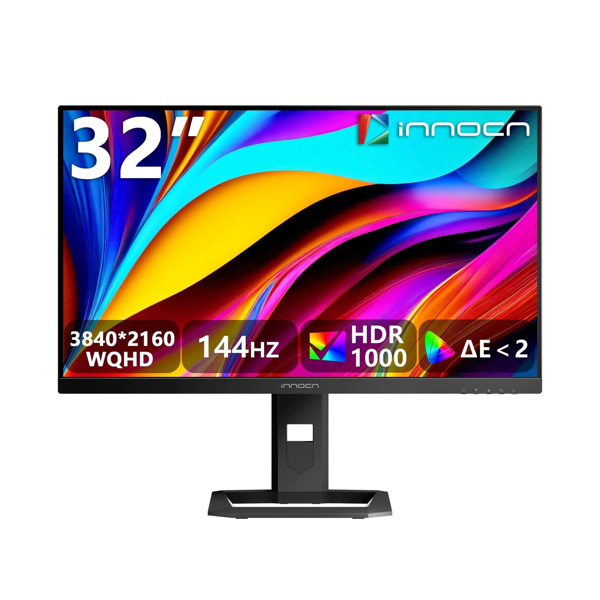
*INNOCN 32M2V press image (144Hz version; the 160Hz rev shares the chassis). Image: INNOCN*

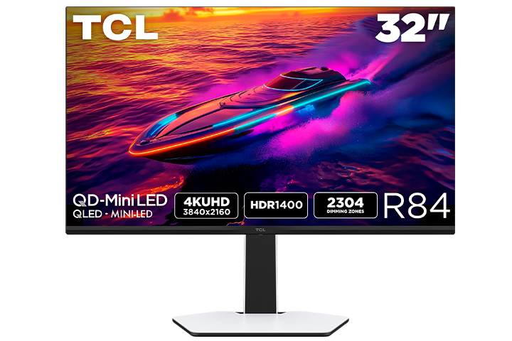
*TCL 32R84 press image — note the "2,304 DIMMING ZONES" badge, which a Reddit flicker-count teardown disputes (below). Image: TCL US*

**INNOCN 32M2V**: [TechPowerUp's headline](https://www.techpowerup.com/review/innocn-32m2v/) is the pitch — "Aggressive Pricing, Excellent HDR": 1,152 zones make it the only true HDR1000 4K anywhere near $500, with 99% DCI-P3, HDMI 2.1 and a height/pivot stand. Against it (DisplayNinja): halos in some scenes, occasional flicker when VRR runs with local dimming on, and the usual small-brand warranty lottery. The 2026 160Hz rev is $499.99 direct (from $799.99 list); it hit $399.98 on Amazon in August but is currently OOS there — buy from INNOCN's store. **The answer to "cheapest way onto 4K Mini LED" — accept the after-sales dice roll.**

**TCL 32R84**: flag the zone count first — the press render says **2,304 zones**, a Reddit flicker-count teardown measured 50×28 = **1,400** ([teardown thread](https://www.reddit.com/r/Monitors/comments/1p81t3g/)), and TCL support insists "1,400 is the peak-brightness nits; it really has 2,304 zones" ([support thread](https://www.reddit.com/r/Monitors/comments/1p7k8cq/tcl_32r84_actually_has_2304_dimming_zones)). Either way it's the most zones per dollar in the tier. Specs: HDR1400 (~1,400-1,500 nits peak), 96% DCI-P3, 90W USB-C single-cable. The [r/OLED_Gaming long-term review](https://www.reddit.com/r/OLED_Gaming/comments/1nruxpb/tcl_r84_32_miniled_review_my_oled_alternative) calls it "the best LCD monitor I've owned, trading blows with a 240Hz OLED"; Best Buy's family sits at 4.6-4.7★. The cons are textbook Mini LED: cursor halos on dark scenes, a counter-blooming algorithm that clamps highlights, VA dark smear (fixable), and a matte coating that some find grainy on text.

**Neo G7 (G70NC)**: the 2022 benchmark for this class (1,196 zones, 1000R curve), RTINGS-approved in its day; now Amazon-direct OOS with third parties at $699 — EOL clearance. **Unless it dips under $600, either pick above is the better buy.** Stepping up, the BenQ EX321UX (~$1,100) and ASUS PG32UQX (~$1,700+) cost more without changing the story — skipped.

**The OLED ladder** (all Samsung QD-OLED panels):

| Model | Snapshot price (9/19, measured) | Refresh | One-line role |
|---|---|---|---|
| [Dell S3225QC](https://www.amazon.com/dp/B0FB46P6F6) | Amazon **$641.99** · Walmart ~$572 · refurb $519.99 (MSRP $849.99) | 120Hz | Cheapest name-brand 32″ 4K QD-OLED + good speakers |
| [MSI MAG 321UP](https://www.amazon.com/dp/B0D9HY3JH2) | **$671.14** | 165Hz | Same panel as 321URX, cost-trimmed |
| [LG 32GX850A-B](https://www.amazon.com/dp/B0FLQLPNNH) (2026) | **$749.99** (list $1,299.99) | 4K165 / FHD330 dual mode | Glossy WOLED, the dual-mode gaming value king |
| [MSI MPG 321URX](https://www.amazon.com/dp/B0DPXYZYPT) | **$799.99-859** | 240Hz | The 4K 240Hz QD-OLED baseline |
| [Alienware AW3225QF](https://www.dell.com/en-us/shop/alienware-32-curved-qd-oled-gaming-monitor-aw3225qf/apd/210-bmqq/monitors) | Dell direct $999.99 (Amazon 3rd-party $1,139 inflated; promos $780-900, ATL $699.99) | 240Hz | 1800R curve, Dell 3-yr burn-in warranty |

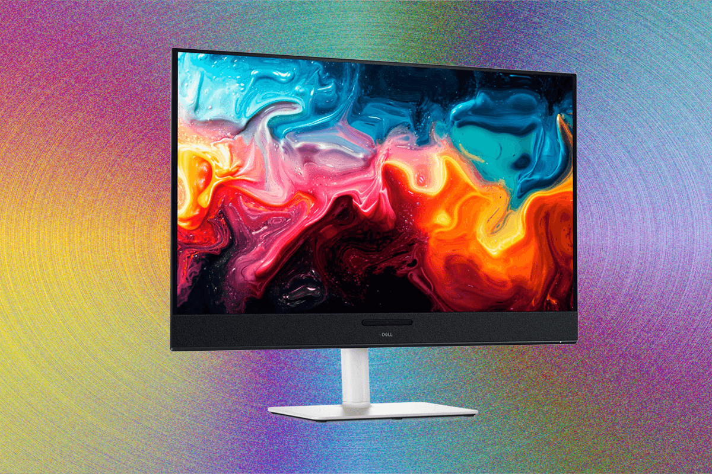
*Dell S3225QC: white stand, speaker grille below the panel; 32″ 4K QD-OLED at 120Hz. Image: WIRED*

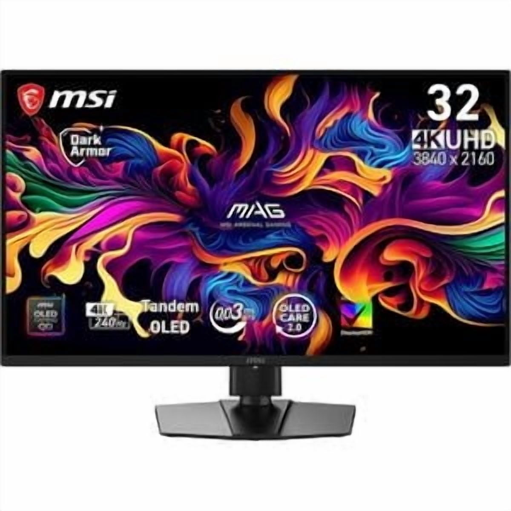
*MSI MAG 32″ QD-OLED family render (shown: the 2026 321UPX with Tandem OLED panel; the 321UP/321URX use the previous-gen QD-OLED). Image: Walmart listing*

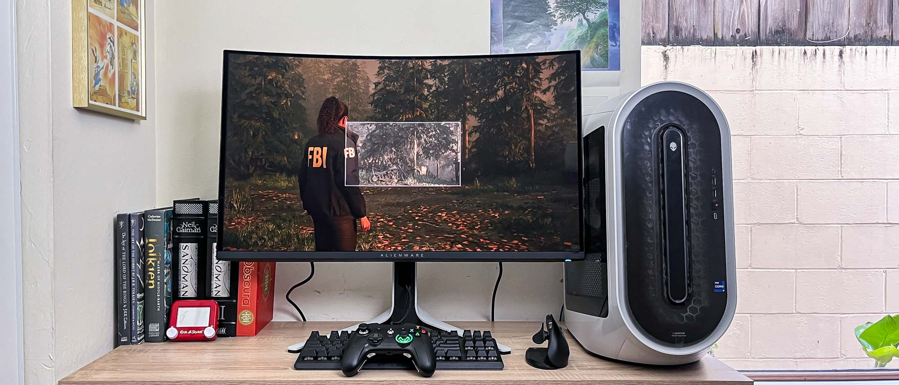
*AW3225QF: 1800R curve on the Legend-ID stand; 4K 240Hz QD-OLED. Image: Tom's Guide*

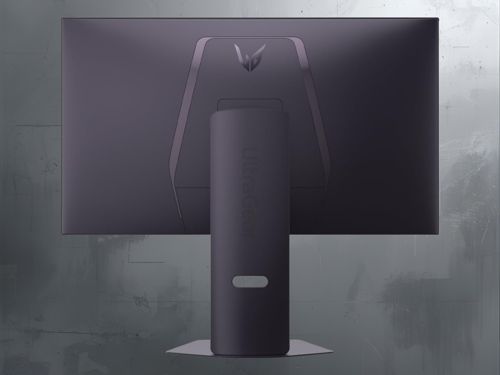
*LG 32GX850A UltraGear (2026): glossy WOLED with Dual Mode 4K165/FHD330. Official render (rear). Image: NotebookCheck*

**Dell S3225QC**: [RTINGS' comparison](https://www.rtings.com/monitor/reviews/dell/s3225qc) against its IPS-Black sibling (S3225QS) ends in a clean picture-quality sweep — deep blacks, bright highlights, wide gamut; [WIRED scored it 9/10](https://www.wired.com/review/dell-32-plus-qd-oled/), with speakers "better than almost every other monitor I've tested". Tom's Hardware's deductions: 120Hz only, no gamma presets; the triangular-subpixel text fringe and ABL dimming in bright rooms are QD-OLED-wide traits. **$519 (refurb) to $642 (Amazon) depending on channel — still the floor for "name brand + OLED + 4K", and the productivity-plus-media pick; hunt Walmart (~$572) or refurb for the bottom price.**

**MSI MAG 321UP / MPG 321URX**: one 31.5″ 4K QD-OLED panel, two trims — the 321UP is the MAG line's **165Hz cost-down** (basic stand, fewer ports; measured $671.14 on Amazon), the 321URX the **240Hz full trim** (90W USB-C + KVM, from $799.99). TFTCentral confirms the family shares OLED Care 2.0 and a **3-year warranty that covers burn-in** (2026 adds a 321UPX with the new Tandem OLED panel, ~$780+). [RTINGS calls the 321URX](https://www.rtings.com/monitor/reviews/msi/mpg-321urx-qd-oled) a "superb gaming monitor"; PCGuide's 2025 pick for "the best 4K OLED". **165Hz is enough → 321UP saves ~$130; want 240Hz → 321URX.**

**LG 32GX850A-B (2026 dark horse)**: LG's 2026 32″ **glossy WOLED** UltraGear built around Dual Mode — one-key switching between **4K @165Hz and FHD @330Hz** — with 0.03ms, G-SYNC Compatible and 1.5M:1 contrast. Measured **$749.99** on Amazon (list $1,299.99), $50 under the 321URX with an extra 330Hz gear. Too new for professional reviews yet; early Best Buy feedback centers on the "RPG vs competitive in one toggle" flexibility. Mind the ~275-nit full-field brightness (typical WOLED — brightness-first buyers should look at Mini LED). **The default answer at $750 for an OLED gaming panel.**

**Alienware AW3225QF**: 1800R-curved 4K 240Hz QD-OLED, an RTINGS premium pick, 4.7★ at Best Buy, Dell 3-year burn-in coverage. Promos run $780-900 with an all-time low of $699.99 (Feb 2026); right now Dell direct asks $999.99 and Amazon third parties $1,139 — **wait for a sale**. If the curve works for you it's the flavor pick; otherwise the 321URX. Above this sits the PG32UCDM ($900-1,050) and the dual-mode LG 32GS95UE (4K240/FHD480, ~$1,000-1,300) — only if the budget is uncapped.

**How to choose, cheapest first**: under $400 and no compromises left → Acer XV325QK (31.5″ Mini LED); ~$500 INNOCN 32M2V (steadier HDR reputation) or the 27″ XV275K ($349.99, §7.8); ~$600 for work-first with peace of mind → Dell S3225QC (Walmart ~$572 or refurb $519.99 is the deal); ~$650 if burn-in anxiety rules and HDR brightness matters → TCL 32R84 (no burn-in to fear, and the zone dispute doesn't change the picture-quality verdict); ~$671 for 165Hz gaming → MSI MAG 321UP; ~$750 for serious gaming → LG 32GX850A-B (dual mode) or MSI MPG 321URX (from $799.99); the curved AW3225QF is the flavor pick on a promo. Housekeeping either way: on OLED set a burn-in screensaver and auto-hiding taskbar; on Mini LED, dark-scene halos are physics, and VRR + local dimming together can flicker occasionally.

### 7.8 The 27-inch tier: cheaper than 32″ (2026-09-19 addendum)

> Same requirements (4K + Mini LED / OLED + ≥100Hz) walked down to 27″, priced the same way as §7.7 (live Amazon in a real browser, specs verified against listing text). Verdict first: **the 27″ Mini LED floor is $349.99 — $50 below the cheapest 32″ — but 27″ OLED runs dearer than 32″ ($799 up). If OLED on a budget: buy 32″ (Dell $641.99). If Mini LED on a budget: either size works.**

**27″ 4K Mini LED**:

| Model | Snapshot price | Zones | Panel / refresh | One-line role |
|---|---|---|---|---|
| [Acer Nitro XV275K](https://www.amazon.com/dp/B0FKNB5D1W) | **$349.99** | **1,152** | Fast IPS · 4K160 / FHD320 dual mode (DFR) · HDR1000 | Cheapest of everything: 1,000 nits + 99% Adobe RGB |
| [KTC M27P6](https://www.amazon.com/dp/B0F7Q8ZWLY) | $424.99 (list $499.99) | **1,152** | Fast IPS · 4K160 / FHD320 · HDR1400 · USB-C 65W · KVM | +$75 buys HDR1400, Type-C single-cable, white |

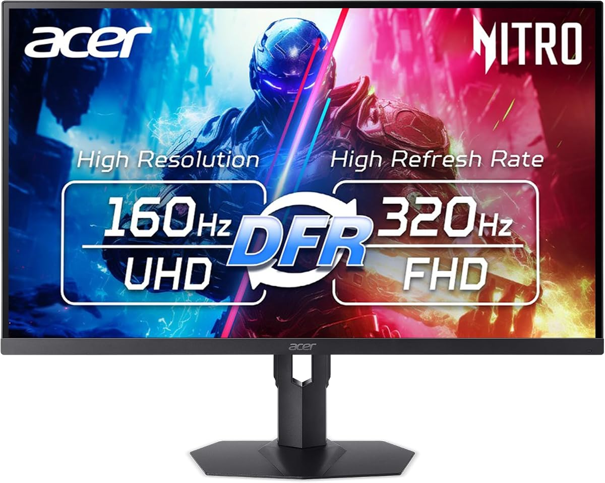
*Acer Nitro XV275K (27″) / XV325QK (31.5″) share this official render: the 4K160 / FHD320 DFR dual mode. Image: Amazon listing*

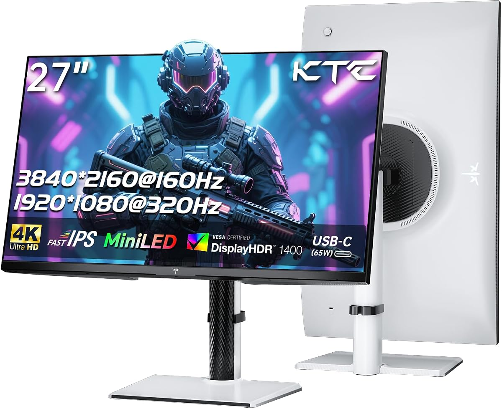
*KTC M27P6: white chassis, 4K160/FHD320 dual mode, HDR1400, USB-C 65W, KVM. Image: Amazon listing*

**XV275K**: the listing states **1,152 zones**, VESA DisplayHDR 1000, 1,000 nits, 0.5ms GtG, 99% Adobe RGB / 97% DCI-P3 in so many words. Professional reviews of this exact rev are still scarce; but the previous XV275K P3 (576 zones) was already an RTINGS value favorite, and the new one doubles the zones, adds the DFR dual mode and costs less. **The answer to "cheapest possible Mini LED."**

**KTC M27P6**: DisplayNinja (July 2026) rates it "the best 27″ mini LED HDR gaming monitor" (4K 160Hz + 1080p 320Hz dual mode, 1,152 zones); PCMag calls out top-notch HDR, a full port selection and clean build. The previous value king INNOCN 27M2V is gone from Amazon (DisplayNinja now points to the KTC too), and Cooler Master's GP27U has been delisted as well. KTC's even cheaper QD-MiniLED M27U6 ($314.98) is 4K@72Hz — under the ≥100Hz bar, excluded.

**27″ 4K OLED** (from $799 — dearer than 32″ OLED):

| Model | Snapshot price | Refresh | One-line role |
|---|---|---|---|
| [Samsung Odyssey G81SF](https://www.amazon.com/dp/B0DVM3BJHK) | **$799.00** (list $1,299.99) | 240Hz | 4K QD-OLED 166 PPI · Glare Free · full anti-burn-in kit |
| [MSI MPG 272URX](https://www.amazon.com/dp/B0DWYC5S8X) | **$799.99** | 240Hz | DP 2.1 UHBR20 · 98W USB-C · 3-yr burn-in warranty |
| [ASUS ROG XG27UCDMG](https://www.amazon.com/dp/B0DM6RWRQC) | $948.38 | 240Hz | 2026 Tandem QD-OLED (PG27UCDM currently $1,099, inflated) |

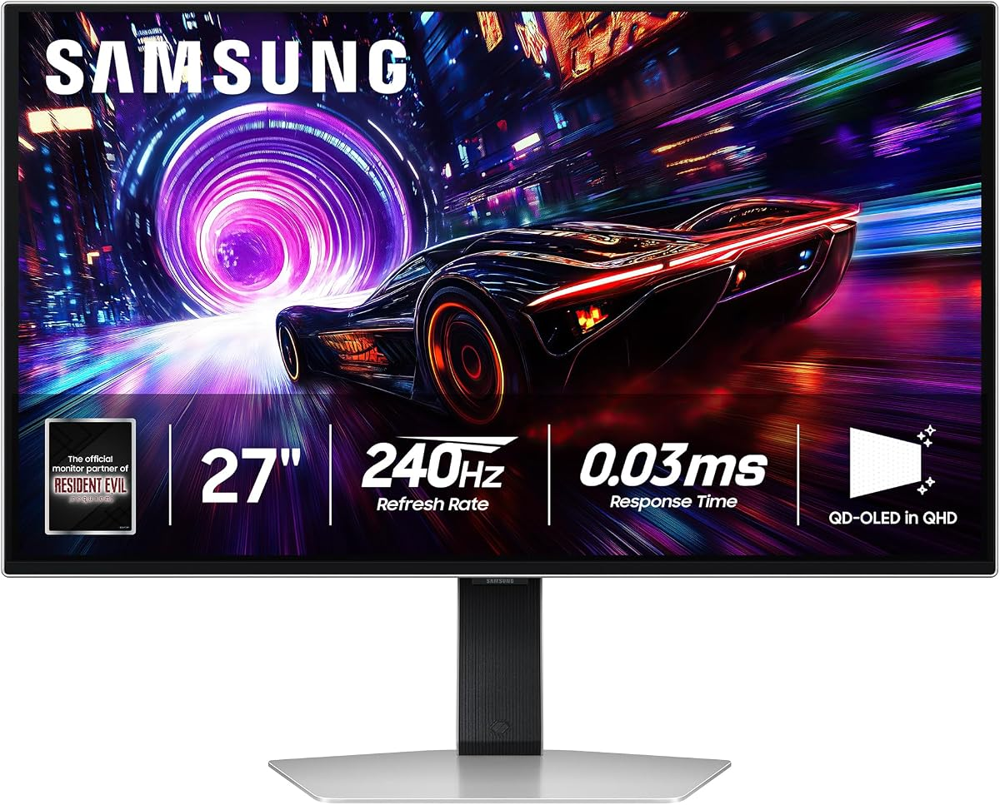
*Samsung Odyssey G8 27″ official image (badge carries the series' older copy; the listing is the G81SF, 4K 240Hz). Image: Amazon listing*

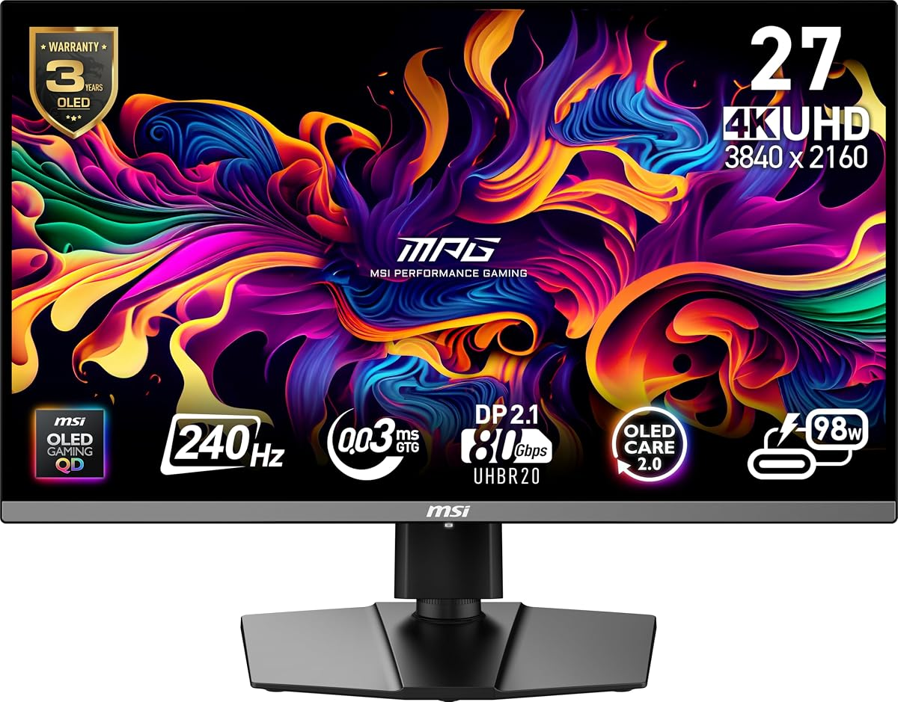
*MSI MPG 272URX: 27″ 4K 240Hz with DP 2.1, 98W USB-C, and the 3-year OLED warranty printed on the badge. Image: Amazon listing*

**G81SF**: TechRadar — "one of the best, if not the best, 4K 27-inch gaming monitor money can buy in its class"; RTINGS praises its deep blacks and vivid color for HDR content. Samsung's differentiator is the **anti-burn-in kit**: a pulsating-heat-pipe active cooler plus automatic logo/taskbar brightness detection. **272URX**: the 32″ 321URX's sibling with the fullest spec sheet (DP 2.1 UHBR20, 98W USB-C, OLED Care 2.0, 3-year burn-in warranty). They cost nearly the same — pick the G81SF for Samsung's burn-in software, the 272URX for ports and warranty terms.

**27″ vs 32″**: OLED on a budget → **buy 32″** (Dell $641.99 / LG $749.99 — cheaper and bigger than 27″ OLED at $799); Mini LED on a budget → the 27″ XV275K at $349.99 is the floor of the whole market; shallow desk (<70cm) or a preference for 166-PPI text sharpness → 27″ OLED earns its keep; big-screen media → 32″.

### 7.9 E-bikes: a survey of mainstream US flat-bar models (2026-09-19)

> Requirements: rider height **179cm (5'10.5″)**, flat bar (mountain / flat-bar-road form factor), **60+ honest miles of range**, a strong motor, **removable battery** / USB output, **as light as possible**, decent suspension — and it must carry recognized professional reviews and community consensus. Prices are **live manufacturer-site snapshots taken 2026-09-19** (Shopify price feeds checked store by store; Trek/Specialized/Giant/Priority at their site prices that day). Professional opinions come from Electric Bike Report (EBR, standardized drain-the-battery range tests), Bicycling, WIRED, OutdoorGearLab, Tom's Guide, CNET, Ebike Escape, ElectricBikeReview.com and the r/ebikes community (linked inline). For the SB 1271 compliance background see §7.3 — not repeated here.

**Four things to align on before reading the table**:

1. **"60 honest miles" = a 720Wh-class battery + eco mode.** EBR's methodology is [riding each bike until the battery dies](https://electricbikereport.com/how-we-test-electric-bikes/), once at max assist and once at minimum — vendor "up to 60mi" claims map to the minimum-assist run. Rule of thumb 10-25 Wh/mi; **conservative formula: Wh ÷ 20 = guaranteed miles**. The "range" column below gives the EBR/press-tested Eco↔Turbo interval wherever it exists.
2. **Light weight and big batteries are physically exclusive**: 370Wh-class light bikes weigh 36-39lb but deliver <40 honest miles; anything that can truly do 60mi weighs 55-77lb. This survey prioritizes range; a separate light-weight tier flags the range cost.
3. **UL certification is now a hard gate** (SB 1271, effective 2026-01-01): of the models below only the Jasion EB5 line lacks certification; Lectric/Velotric/Aventon/Ride1Up/Radster are UL 2849 across the line (batteries UL 2271).
4. **The 2025 tariffs raised prices and they are not coming back** (peak 55-70%, still ~56% after the Nov-2025 de-escalation, [PeopleForBikes tracker](https://www.peopleforbikes.org)): 2026 "list price" is the new normal. Lectric publicly never discounts (only free-accessory bundles and referrals); everyone else's permanent "sale price" is the real price. **Trust the live page at checkout.**

**Main table (prices = 2026-09-19 site snapshots; ★ = this survey's picks)**:

| Model | Price | Battery (all removable) | Motor · sensor | Range (tested first) | Weight | Suspension | 179cm fit |
|---|---|---|---|---|---|---|---|
| ★[Lectric XP4 750 LR](https://lectricebikes.com/products/xp-black-long-range) | **$1,299** | 840Wh · UL 2849/2271 · USB-C out on display | 750W (1,310W peak)/85Nm · torque | **63.4 Eco / 36.9 Turbo mi (EBR)** | ~72lb w/ battery | 50mm coil fork + suspension seatpost | one size 4'10"-6'3" ✓ |
| [Lectric XP4 500](https://lectricebikes.com/products/xp-black) | $999 | 499Wh · UL dual · USB-C | 500W/55Nm · torque | 55.1 / 30.2mi (EBR) | ~70lb | 50mm fork | one size ✓ |
| [Lectric XPress 2](https://lectricebikes.com/products/xpress-750-high-step-black-ebike) | $1,399 | 672Wh · UL 2271 | 750W (1,310W peak)/85Nm · torque/cadence dual | no independent test | ~64lb | rigid (commuter) | one size ST/HS ✓ |
| [Lectric XPeak 2.0](https://lectricebikes.com/products/xpeak-high-step-ebike) | $1,399 (LR $1,599) | 720Wh / 960Wh LR · UL · USB-C | 750W (1,310W peak)/85Nm · PWR+ hybrid | 46.1mi throttle-only (960Wh bike, EBR); claimed 60/80 | ~75lb | 80mm RST fork | ST 5'2"-6'3" / HS 5'4"-6'5" ✓ |
| ★[Ride1Up Portola 02](https://ride1up.com/product/portola/) | **from $895** | 480Wh / 720Wh dual · **UL 2849** | 750W/90Nm · **torque-or-cadence switch** | 25-45mi (10Ah) / 30-60mi (15Ah) | — | rigid (folding fat) | one size, high-step/mid-fold |
| [Ride1Up TrailRush](https://ride1up.com/product/trailrush/) | $1,995 | 504Wh Samsung | **Brose mid-drive 90Nm · torque** | claimed 30-50mi | — | **120mm RockShox + 150mm dropper** | M/L ✓ |
| ★[Velotric Discover 2](https://www.velotricbike.com/products/velotric-discover-2) | **$1,499** (sale) / $1,999 | 705.6Wh · UL 2271 · **USB-C out** | 750W (1,100W peak)/75Nm · SensorSwap | **86.7 Eco / 37.4 Turbo mi (EBR)** | 63lb | 80mm hydraulic fork | R 4'11"-5'9" / L 5'6"-6'4" ✓L |
| [Velotric Nomad 2](https://www.velotricbike.com/products/velotric-nomad-2) | $1,999 (**+$550 battery free**) | 705.6Wh · UL 2271 · USB-C | 750W (1,300W peak)/90Nm | claimed 65/45mi | 75lb (505lb payload) | 100mm RST fork | R 5'2"-5'11" / L 5'10"-6'5" ✓L |
| [Velotric Summit 1](https://www.velotricbike.com/products/velotric-summit-1) | $1,699 | 705.6Wh · UL 2271 | 750W (1,300W peak)/90Nm | claimed 70/60mi | 62lb | 120mm hydraulic fork | R 5'1"-5'10" / L 5'8"-6'6" ✓L |
| ★[Aventon Level 4 REC](https://www.aventon.com/products/level-4-rec) | $1,999 | 733Wh · UL · regen braking | 750W (1,440W Boost)/80Nm · torque | **97 Eco / 43.8 Turbo mi (EBR)** | 68.5lb | 80mm fork + 50mm suspension seatpost | R 5'3"-5'10" / L 5'10"-6'4" ✓L |
| [Aventon Aventure 3](https://www.aventon.com/products/aventure-3) | $1,999 | 733Wh · UL 2271 | 750W (1,440W Boost)/80Nm · torque | claimed 65mi (no independent test) | 76lb (400lb payload) | 80mm fork + sus seatpost + 26×4.0 | R / L ✓L |
| [Aventon Ramblas ADV](https://www.aventon.com/products/ramblas-adv) | $2,899 | 708Wh · TÜV/UL 2271 | **A100 mid-drive 250W (750W peak)/100Nm · torque** | top-5 EBR range chart (claimed 90mi) | **54lb** | **130mm RockShox + 150mm dropper + SRAM 4-piston** | M 165-176 / L 177-188 ✓L |
| [Mokwheel Basalt ST 2.0](https://mokwheel.com/products/basalt-st-2-0-s) | $1,800 | **940Wh** IPX7 · UL 2849 | 750W (1,100W peak)/85-90Nm · torque+cadence | claimed 60-80; dealer-measured ~48mi mixed | n/a (450lb payload) | fork + 26×4.0 | sibling line 5'5"-6'7" ✓ |
| [Rad Radster Road](https://www.radpowerbikes.com) ⚠️ | $1,999 | 720Wh SafeShield · UL dual · USB-C | 750W/**100Nm** · torque | claimed 25-65mi | 74.5lb | 80mm hydraulic fork | L 5'7"-6'4" ✓ |
| [Trek Marlin+ 6](https://www.trekbikes.com/us/en_US/bikes/mountain-bikes/electric-mountain-bikes/marlin/marlin-6-plus/p/41180/) | $2,499 | 400Wh Bosch (+250Wh range extender opt.) | Bosch Active Line Plus mid-drive 50Nm | 57 Eco / 29 Turbo (EBR, same system as Marlin+ 8) | ~50lb | 120mm coil fork | S-XXL, 179→L |
| [Giant Talon E+](https://www.giant-bicycles.com/us/talon-eplus) (2026) | $2,950 | 430Wh (+250Wh opt.) | SyncDrive Sport 2 (Yamaha) 75Nm · 6-sensor | official tiers 71/54/35mi | **47.8lb (lightest hardtail)** | 100mm fork | official chart 179→**M/L boundary** |
| [Specialized Tero 3.0](https://www.specialized.com/us/en/turbo-tero-30/p/275157) (clearance) | $2,749 (EOL) | 530Wh · **UL 2849/2271 stated on page** | 2.0E mid-drive 50Nm | claimed up to 68mi | 51lb | 110mm fork | S-XL, 179→L |
| [Ride1Up Prodigy V2](https://ride1up.com/product/prodigy-v2/) | $2,395 (sale) | 504Wh Samsung | Brose mid-drive 90Nm · torque | 73 Tour / 32 Boost (ElectricBikeReview) | 58-61lb | 100mm air fork | ST 5'0"-6'0" / XR 5'5"-6'1" ✓XR |
| [Priority Current Plus](https://www.prioritybicycles.com/products/currentplus) | $3,299 | 720Wh · UL stated | 500W mid-drive (140Nm peak) · torque | claimed 20-75mi (owners 40-50 mixed) | 55lb | **none** (belt + internal gearing) | S/M/L, 179→L |
| [Aventon Soltera 3 ADV](https://www.aventon.com/products/soltera-3-adv) (light tier) | $1,499 (out of stock; prior 2.5 $1,199 in stock) | 366.8Wh | 250W (500W peak)/40Nm · torque | ~40mi class | **37lb** | rigid | L 5'9"-6'1" ✓ |
| [Velotric Tempo](https://www.velotricbike.com/products/velotric-tempo-city-ebike) (light tier) | $1,499 | 374Wh · UL dual · USB-C | 350W (650W peak)/45Nm | claimed 60mi (dubious at 374Wh) | 39lb | rigid | HS L 5'6"-6'4" ✓ |
| [Jasion EB5 Ultra](https://www.jasionbike.com) (white-label) | delisted from own site; Amazon ~$349-500 swings | 1040Wh · **no UL** | "2500W peak" (marketing) · cadence | no test | — | dual spring forks | one size |

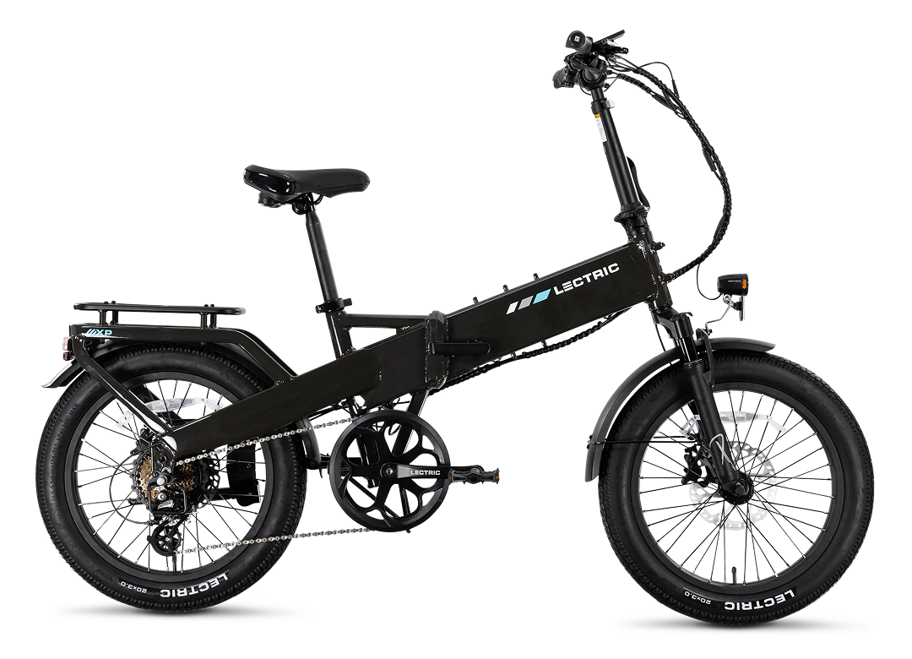
*Lectric XP4 750 Long-Range (high-step): 840Wh + 85Nm + USB-C out — the best range-per-dollar on the table at $1,299. Image: Lectric*

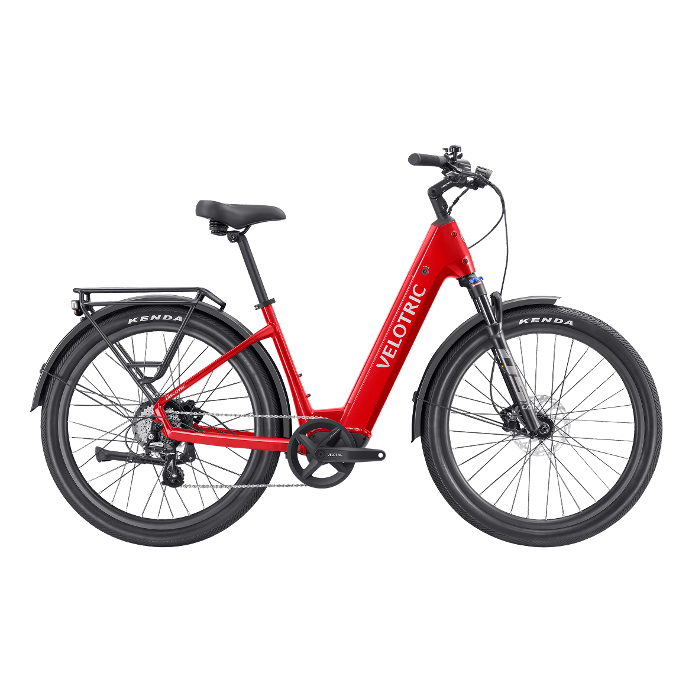
*Velotric Discover 2: 705.6Wh + USB-C out + dual UL certification, on sale at $1,499. Image: Velotric*

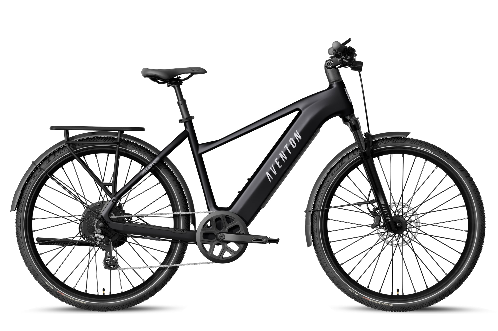
*Aventon Level 4 REC: Bicycling calls it "our baseline e-bike"; EBR measured 97 miles in Eco. Image: Aventon*

**Budget tier (≤$1,000)**: the [XP4 500](https://lectricebikes.com/products/xp-black) ($999) is OutdoorGearLab's 2026 ["spectacular value"](https://www.outdoorgearlab.com/topics/biking/best-electric-bike) — torque sensor, hydraulic brakes, full UL kit, 55.1mi low-assist tested. Cheaper still: the [Ride1Up Portola 02](https://ride1up.com/product/portola/) (**from $895**) took EBR's 2026 "Best Budget" — 750W/90Nm + torque/cadence dual sensor + **UL 2849**, the only certified torque-sensing folding fat bike under $1,000 (15Ah version claimed 30-60mi). Heybike's Cityscape 2.0 ($899; $799 "Deal" variant) is a rare white-label with a UL 2849 claim, but "in accordance with" ≠ "UL Listed" — verify the certificate before dorm charging. The XP Lite 2.0 ($899, 49lb) is the lightest trustworthy folder here, but cadence-only + 375Wh std battery means short trips only.

**The $1,000-2,000 workhorse tier (where 60mi lives)**:

- **XP4 750 LR ($1,299) — the range answer inside a budget.** [WIRED, Nov 2025](https://www.wired.com/review/lectric-xp4-750-electric-bike/): "The best affordable ebike on the market. Astounding range for the price"; [OutdoorGearLab scored it 86/100, #2 of 19 tested](https://www.outdoorgearlab.com/reviews/biking/electric-bike/lectric-xp4-750); EBR measured 63.4mi in Eco. The $300 step up from the 500 buys 840Wh + 85Nm + suspension seatpost — **the lowest-priced entry to an honest 60mi on this table**. Downsides: heavy folding structure (~72lb with battery), and the 50mm coil fork is basic suspension at best.
- **Discover 2 ($1,499 sale) — best single spec sheet for the money**: 705.6Wh + USB-C out + dual UL + 440lb payload; EBR testing relayed by RiderGuide measured 86.7mi Eco; Ebike Escape praises seat comfort and integration. Reddit gripes: 63lb heft, DTC service without local shops, and the vendor's own torque spec inconsistency (75 vs 90Nm). 179cm takes the L.
- **Level 4 REC ($1,999) — the press-consensus baseline**: [Bicycling 2026-08](https://www.bicycling.com/bikes-gear/a20048026/best-electric-bikes/) ("our baseline e-bike"), [OutdoorGearLab 85/100 best daily](https://www.outdoorgearlab.com/topics/biking/best-electric-bike), and EBR's "Best Commuter" all pick the same bike; torque sensor + regen + 733Wh, and EBR's 97-mile Eco run is the longest tested figure on this table. Known tax: Aventon's slow customer service is a long-running Reddit complaint.
- **Aventure 3 ($1,999)**: the do-everything fat position — 400lb payload, 80mm fork + suspension seatpost, 30-second Boost overclock; EBR-positive but 76lb is among the heaviest here.
- **Nomad 2 ($1,999 with a free $550 long-range battery)**: effectively **dual batteries from the factory**; 505lb payload leads the table; EBR 4.7/5 "Best Comfort". For full suspension see the new Nomad 2X ($2,299, rear-shock version).
- **Summit 1 ($1,699)**: Velotric's entry mountain bike — 120mm fork + 27.5×2.6 + Shimano hydraulics; [Ebike Escape](https://ebikeescape.com/velotric-summit-1-review) called it "the most affordable trail-worthy ebike I've reviewed", though a hub motor caps steep climbs below mid-drives.
- **Mokwheel Basalt ST 2.0 ($1,800)**: 940Wh, second-largest battery here, with the unique trick that the battery can power an optional **inverter accessory — a portable power station** for camping/outages; [ElectricBikeReview's tested take](https://electricbikereview.com/mokwheel/basalt-2-review) is favorable, but small-brand QC is a lottery (one reported controller failure after rain).
- **Radster Road ($1,999) ⚠️**: the best-specced Rad ever (100Nm torque + dual UL + 720Wh), but **Rad Power filed Chapter 11 in Dec 2025**; assets sold for $13.2M to Life EV (closed Mar 2026), and **warranties on bikes sold before Dec 15, 2025 are not honored** — evaluate as "buying the hardware, not the warranty"; not recommended for first-time buyers.

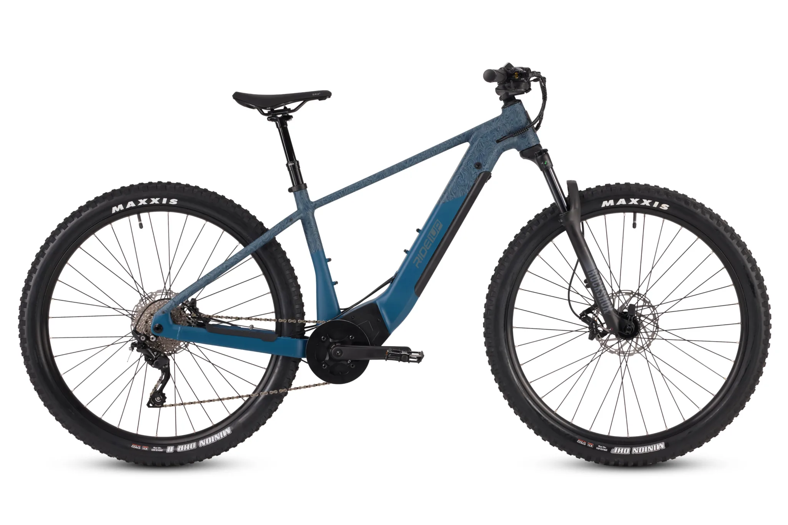
*Ride1Up TrailRush: Brose mid-drive + 120mm RockShox + 150mm dropper — $1,995 buys WIRED and Bicycling's shared "best cheap eMTB". Image: Ride1Up*

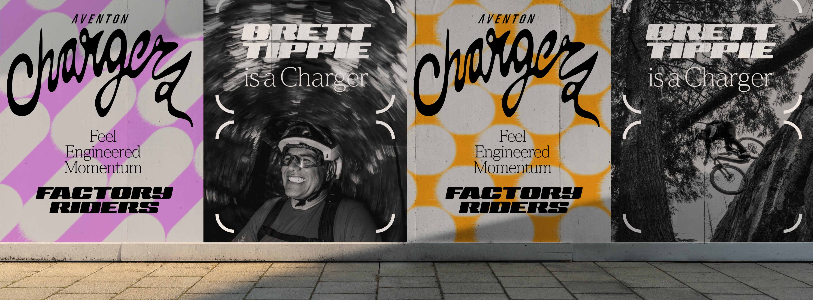
*Aventon Ramblas ADV: in-house A100 mid-drive at 100Nm + 130mm RockShox Psylo, 54lb; EBR 4.8/5, Ebike Escape 9.3/10. Image: Aventon*

**Mountain / step-up tier ($2,000+)**:

- **TrailRush ($1,995) — the only real mountain bike under $2,000**: German Brose mid-drive at 90Nm + 120mm RockShox Judy + **150mm dropper** + Shimano Deore 10-speed + 4-piston hydraulics; no competing spec sheet at the price, and [WIRED and Bicycling jointly crowned it 2026's "best cheap eMTB"](https://www.bicycling.com/bikes-gear/a20048026/best-electric-bikes/). At 504Wh with a claimed 30-50mi, 60mi is out — mountain or range, pick one.
- **Ramblas ADV ($2,899) — the budget-eMTB benchmark**: in-house A100 mid-drive at 100Nm + 708Wh, and 54lb makes it the lightest mid-drive here; [EBR 4.8/5](https://electricbikereport.com/aventon-ramblas-review), Ebike Escape 9.3/10, OGL 4.5/5, top-5 on EBR's all-time range chart. **The only bike on this table that satisfies real suspension + light + 60mi (eco) simultaneously.** 179cm takes L (177-188).
- **Marlin+ 6 ($2,499)**: the cheapest legitimate Bosch bike — Active Line Plus mid-drive + 400Wh, with a dealer network no DTC can match; the costs are 400Wh (57mi Eco tested) and 50Nm. Step to the Marlin+ 8 ($3,999) for the air fork and 12-speed.
- **Talon E+ (2026, $2,950)**: lightest of the three (47.8lb) and the only one with an official size chart (179cm sits on the M 171-184 / L 176-192 boundary — choose by inseam); Yamaha-based 75Nm + 6 sensors; the cost is the smallest battery here at 430Wh. Cycling Electric gave the prior generation 4.5/5 as best-value hardtail eMTB.
- **Tero 3.0 ($2,749, clearance)**: 530Wh + Class 3 + UL dual certification printed on the page, down from $3,250 and discontinued — ride-quality praised (BikeRadar 3.5/5) but the 50Nm motor is gentle; **grab one before they're gone**.
- **Prodigy V2 ($2,395 sale)**: the Brose mid-drive commuter; ElectricBikeReview measured 73mi in Tour (flat-eco scenario); 100mm air fork; the 504Wh battery is small and the XR size (5'5"-6'1") tops out right at 179cm.
- **Current Plus ($3,299) — the ten-year maintenance-free flagship**: Gates belt + Shimano internal gearing + torque mid-drive + 720Wh; press calls it a premium ride. **No suspension, 55lb** — it competes on worry-free commuting, not trails.

**Light tier (60mi is out — know it going in)**: [Soltera 3 ADV](https://www.aventon.com/products/soltera-3-adv) ($1,499, **currently out of stock**; the prior Soltera 2.5 at $1,199 is in stock and was [CNET's 2026 "best e-bike overall"](https://www.cnet.com/roadshow/personal-mobility/best-electric-bike/)) at 37lb with a torque sensor is WIRED's 2026 best commuter; Velotric Tempo ($1,499) at 39lb + USB-C; the T1 ($2,199) is lightest at 36lb with a 352.8Wh battery. **Real range for this entire tier is <45mi** — fine for a campus where charging is easy and distances are short, but mutually exclusive with the 60mi goal.

**Brand risk, ranked (2026-09)**: dealer brands (Cannondale/Marin/Trek/Giant/Specialized) > large DTC (Lectric/Aventon/Velotric/Ride1Up) > mid-size DTC (Heybike/Mokwheel) > Amazon white-labels (Jasion/Engwe/Totem) > bankrupt-reboot (Rad) > dead (Juiced). Two cautionary tales: **Juiced went bankrupt in late 2024 and Lectric bought the IP in Mar 2025 — batteries and warranties evaporate with the company**; and Rad Power above. White-label pathologies: inflated wattage ("2500W peak" is a peak marketing number), no UL (unsellable in California after SB 1271), and after-sales that live exactly as long as the store.

**The 2026 list consensus across six outlets** (winners cross-check against the table above):

| Outlet (updated) | Budget/value | Commuter baseline | Best cheap eMTB | Light tier |
|---|---|---|---|---|
| [WIRED](https://www.wired.com/story/best-electric-bikes/) (2026-04) | Lectric XP4 750 (best-selling/best value) | Soltera 3 (best commuter) | TrailRush | Soltera 3 (37lb) |
| [Bicycling](https://www.bicycling.com/bikes-gear/a20048026/best-electric-bikes/) (2026-08) | Soltera 2.5 (best cheap) | **Level 4 REC (baseline)** | TrailRush | — |
| [EBR](https://electricbikereport.com/best-electric-bikes/) (2026) | Portola (best budget) / XP4 (best value) / XPress 2 (budget commuter) | Level 4 REC (97mi Eco tested) | Ramblas ADV (budget eMTB) | — |
| [OutdoorGearLab](https://www.outdoorgearlab.com/topics/biking/best-electric-bike) (2026-07) | XP4 (spectacular value) / XP4 750 best folding (86, #2 of 19) | Level 4 REC (85, best daily) | — | — |
| [Tom's Guide](https://www.tomsguide.com/best-picks/best-electric-bikes) (2026-09) | Roadster V3 (best overall/budget) | Segway Myon | — | — |
| [CNET](https://www.cnet.com/roadshow/personal-mobility/best-electric-bike) (2025-11) | Soltera 2.5 (best overall) | — | — | — |
| r/ebikes community | Lectric (the default budget answer) | Aventon/Ride1Up (step-up) | — | — |

**Conclusions — five ways to spend it at 179cm wanting 60mi**:

1. **Budget floor, $1,299: Lectric XP4 750 LR** — 840Wh/85Nm/USB-C with a tested 63.4mi Eco; the cheapest honest-60mi ticket on the table. Accept the heavy folder and basic fork.
2. **Best single spec sheet, $1,499: Velotric Discover 2** — tested 86.7mi Eco (second-longest here), USB-C out, dual UL, 440lb payload; not the bike for weight watchers.
3. **Press-consensus baseline, $1,999: Aventon Level 4 REC** — three outlets' shared commuter pick with a tested 97mi Eco; slow service is the known tax.
4. **Real suspension: TrailRush at $1,995 first (hardtail + dropper, 60mi out); if 60mi and suspension must coexist, the only answer is the Ramblas ADV at $2,899 (54lb + 130mm + 708Wh)**; beyond that, the Talon E+ at $2,950 (lightest, 47.8lb) and the Marlin+ 6 at $2,499 (Bosch dealer network).
5. **Ten-year flagship: Priority Current Plus at $3,299** — belt + internal gearing + 720Wh; no suspension, pure commuter.

**179cm sizing cheat-sheet**: on DTC two-size lineups (Regular/Large) always take the **L** — 179cm on an R will crowd the knees (exceptions like the Pace 5 REC ST-L 5'9"-6'3" go by inseam); Lectric's one size spans 4'10"-6'3"; Giant's official chart puts 179cm on the **M/L boundary** (M 171-184 / L 176-192) — longer torso takes the L; Trek S-XXL take L; Specialized S-XL take L; Priority S/M/L take L (5'10"-6'3"). Removable batteries are standard across this table; USB output exists on the XP4/XPeak/Discover 2/Nomad 2/Radster and Tempo/T1, and Mokwheel's inverter route is the most complete (AC output). **Re-open every link before ordering — these are 2026-09-19 snapshots and promos move.**

## 8. Method & Limits

- **Distances & times**: 🚗/🚲 values are computed per-route from Palo Verde with the OSRM public routing engine (`routing.openstreetmap.de`, routed-car / routed-bike), free-flow estimates; Google live traffic typically adds 20-40%, worse in LA peaks. A workspace script (`route_watch.py`) **rescans everything daily at 6:00am** and snapshots the data; if a value drifts materially from Google Maps, this note gets a manual revision. Click any destination above for a live Google Maps route;
- **Rideshare estimates**: UberX/Lyft off-peak single-rider ranges modeled from typical OC/LA rates against public fare references — **not live quotes**; peak and event nights run 1.3-2×, shared rides save ~25-35%; calibrate with the app after landing. One-line takeaway: **OC trips run $14-24; LA trips $55-90** — take Amtrak ($19+) plus Metro for LA, or find carpool companions and stay overnight;
- **Verification window**: two research rounds, 2026-09-10/11; the §7 shopping addendum is a 2026-09-16 live-price snapshot (the bed-frame subsection includes a two-pass scan plus next-day reprice); §7.7 monitors are a 2026-09-19 street-price snapshot, §7.8 the same-day 27″ addendum, and §7.9 e-bikes a same-day manufacturer-price verification; all prices/dates come from official or primary ticketing pages (linked inline). Still moving: LA Zoo Lights 2026 dates, LACMA/Huntington/Griffith ticket prices, Neverender face value, every monitor promo in §7.7/§7.8, and every bike price in §7.9 — re-open the links before buying;
- **Images**: Wikimedia Commons (CC0 / CC BY / CC BY-SA), credited per caption — thanks to the photographers.

---

*阅读中文版:[note.zh.md](https://github.com/UniqueClouds/marginalia/blob/main/marginalia/025-irvine-landing-fall-guide/note.zh.md)。*

---

> <svg class="marg-ic" viewBox="0 0 24 24" aria-hidden="true"><circle cx="12" cy="12" r="9" fill="none" stroke="currentColor" stroke-width="2"/><path d="M3 12h18M12 3c2.8 2.6 4.2 5.6 4.2 9s-1.4 6.4-4.2 9c-2.8-2.6-4.2-5.6-4.2-9S9.2 5.6 12 3Z" fill="none" stroke="currentColor" stroke-width="2"/></svg> [阅读中文版](025-irvine-landing-fall-guide.zh.md)

