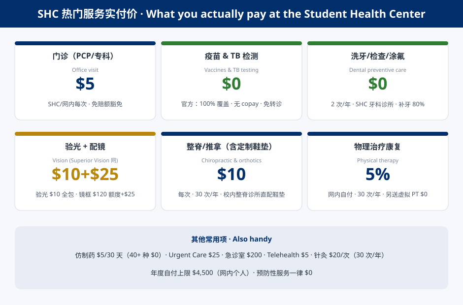
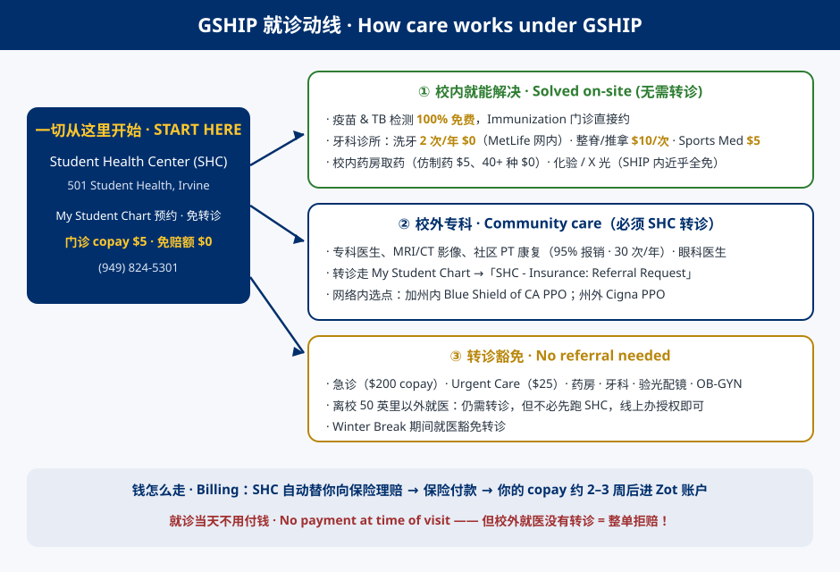

# Using the UCI Student Health Center——getting your money''s worth out of GSHIP

<svg class="marg-ic" viewBox="0 0 24 24" aria-hidden="true"><circle cx="12" cy="12" r="9" fill="none" stroke="currentColor" stroke-width="2"/><path d="M3 12h18M12 3c2.8 2.6 4.2 5.6 4.2 9s-1.4 6.4-4.2 9c-2.8-2.6-4.2-5.6-4.2-9S9.2 5.6 12 3Z" fill="none" stroke="currentColor" stroke-width="2"/></svg> Language / 语言：[中文](026-uci-gship-clinic-guide.zh.md) · **English**

<svg class="marg-ic" viewBox="0 0 24 24" aria-hidden="true"><rect x="4" y="5.5" width="16" height="15" rx="2" fill="none" stroke="currentColor" stroke-width="2"/><path d="M4 10h16" stroke="currentColor" stroke-width="2"/><path d="M8.5 3.5v4M15.5 3.5v4" stroke="currentColor" stroke-width="2" stroke-linecap="round"/><circle cx="12" cy="14.7" r="1.7" class="acc-dot"/></svg> 2026-09-12<svg class="marg-ic" viewBox="0 0 24 24" aria-hidden="true"><path d="M4 5.5A1.5 1.5 0 0 1 5.5 4h6.1c.4 0 .78.16 1.06.44l7 7a1.5 1.5 0 0 1 0 2.12l-6.1 6.1a1.5 1.5 0 0 1-2.12 0l-7-7A1.5 1.5 0 0 1 4 11.48V5.5Z" fill="none" stroke="currentColor" stroke-width="2"/><circle cx="8.7" cy="8.7" r="1.4" class="acc-dot"/></svg> practical-guide(校园医保与校医院实用调研)<svg class="marg-ic" viewBox="0 0 24 24" aria-hidden="true"><path d="M12 5v14M5.85 8.5l12.3 7M18.15 8.5l-12.3 7" class="acc" stroke-width="2.4" stroke-linecap="round" fill="none"/></svg> issue #59

Provenance（来源与元数据）
<table><tr><td>id</td><td>marginalia-026</td></tr><tr><td>title</td><td>Using the UCI Student Health Center——getting your money''s worth out of GSHIP</td></tr><tr><td>date</td><td>2026-09-12</td></tr><tr><td>published</td><td>2026-09-12</td></tr><tr><td>kind</td><td>practical-guide(校园医保与校医院实用调研)</td></tr><tr><td>issue</td><td>59</td></tr></table>

> GSHIP is mandatory for graduate students and costs **$7,771.86** in 2026-27 — but most of its value is hidden inside the on-campus **Student Health Center (SHC)**: no deductible on campus, **$5** office-visit copays, vaccines at **100% free**, dental cleanings **2×/year at $0**, chiropractic (including deep-tissue/soft-tissue work) at **$10/visit**, and custom orthotics fitted on campus. How to read this note: **start with the care-path map (§4), check the folk-lore table (§3) and the rehab breakdown (§5) for your specific need, and keep the terminology & booking scripts (§6) handy when you actually call or book**. Every claim traces to an official document (sources at the end), with quotes you can click through.

## 1. GSHIP in one section: who holds the money, what you get

UCI's own definition: "UC IRVINE SHIP is a **fully-insured, comprehensive** health insurance program … The plan includes **medical, behavioral health, pharmacy, dental and vision benefits**." ([GSHIP page](https://studenthealth.uci.edu/graduate-insurance/)). Enrollment is automatic with registration; premiums post per quarter to your [ZOT account](https://studenthealth.uci.edu/graduate-uc-irvine-ship-costs-and-dates-of-coverage/); you can waive only with comparable coverage by the deadline.

**Premiums**: $6,847.26 for graduate students in 2025-26; **$7,771.86 in 2026-27** ($2,590.62 × 3 quarters); Med first-years $8,693.60, Law $8,561.93.

**Everything changed in 2025-26** — from the [official transition letter](https://studenthealth.uci.edu/files/2025/07/Irvine-Intro-to-Wellfleet-Letter-Student-communication-6.12.25-No-UCIrvine-SHIP-logo.pdf): "UCI has selected **Wellfleet Insurance Company** … **Blue Shield of CA is your PPO Network for services/care in California, and Cigna is your PPO network for services/care outside of California.**"

| Component | Administrator | Network / entry point |
|---|---|---|
| Medical + behavioral health | Wellfleet (customer service 1-877-657-5029) | In-CA [Blue Shield of CA PPO] · out-of-state [Cigna PPO](https://www.mycigna.com/) |
| Pharmacy | Wellfleet Rx (= Express Scripts, [formulary](http://wellfleetrx.com/students/formularies/)) | SHC pharmacy + nationwide network |
| Dental | [MetLife Dental](https://studenthealth.uci.edu/files/2025/08/UC-Irvine-Dental-Plan-Summary.pdf) (PDP Plus, 1-800-438-6388) | SHC Dental Clinic is in-network |
| Vision | [MetLife / Superior Vision](https://studenthealth.uci.edu/files/2025/08/UC-Irvine-Superior-Vision-Plan-Summary-exp0426.pdf) (1-833-EYE-LIFE) | Costco, LensCrafters, Walmart, Target Optical, private practices |

⚠️ Guides still citing "Anthem Prudent Buyer / Delta Dental / Blue View Vision" describe the pre-2025 contract; the live truth is [studenthealth.uci.edu](https://studenthealth.uci.edu/) plus the 2025-26 plan documents.

## 2. The SHC itself: how much one building covers

**Where & when**: [SHC main building](https://www.google.com/maps/search/?api=1&query=Student+Health+Center+501+Student+Health+Irvine+CA+92697) (501 Student Health), M/T/Th/F 8am–5pm, W 9am–5pm, Sat 9am–1pm (seasonal); the [dental clinic](https://www.google.com/maps/search/?api=1&query=500+East+Peltason+Drive+Irvine+CA+92697) sits across the street in Student Health II (500 East Peltason Dr), M–F 8am–5pm. Park at [Lot 19A](https://www.google.com/maps/search/?api=1&query=UCI+Lot+19A+Irvine+CA). In UCI's words ([About Us](https://studenthealth.uci.edu/about-us/)): "staffed with licensed primary care physicians, psychiatrists, licensed clinical social workers, **dentists** … Medical specialists … including **orthopedics/sports medicine** … SHC also offers basic radiology and clinical laboratory services … and an **on-site pharmacy**."

**One front door: [My Student Chart](https://mystudentchart.uci.edu/)** — appointments, refills, messages to the insurance department, itemized statements. Front desk (949) 824-5301.

| Department / service | What it does | Your cost on SHIP | How to book |
|---|---|---|---|
| [Primary Care](https://studenthealth.uci.edu/primary-care/) | General visits, labs, prescriptions, referrals | **$5/visit** | Chart |
| [Sports Medicine](https://studenthealth.uci.edu/specialty-care/) | Musculoskeletal & sports injuries — "Two board-certified specialists … **no referral needed for most visits**" | **$5/visit** | Direct |
| [Chiropractic](https://studenthealth.uci.edu/specialty-care/) | Spinal/joint adjustments, deep-tissue & soft-tissue work, kinesio-taping, **custom orthotics** | **$10/visit** (30/year) | Direct |
| [Immunizations](https://studenthealth.uci.edu/immunizations/) | Full vaccine menu + TB testing | **$0** (100%) | Chart vaccine clinic |
| [Dental Clinic](https://studenthealth.uci.edu/dental-clinic/) | Cleanings, fillings, extractions, nightguards | Preventive **$0**; fillings 20% | (949) 824-5307 |
| [Pharmacy](https://studenthealth.uci.edu/pharmacy/) | Fill/refill, mail delivery, cheap OTC | Generics **$5**, 40+ at **$0** | Chart request |
| [Lab](https://studenthealth.uci.edu/lab/) / [Radiology](https://studenthealth.uci.edu/radiology/) | Bloodwork, X-rays | 100% on campus (deductible waived) | Provider order |
| [Psychiatry & Mental Health](https://studenthealth.uci.edu/psychiatry-mental-health/) | Psych evaluation, medication management | From $5 per visit | Chart; free [Counseling Center](https://counseling.uci.edu/) separate |
| [Nutrition](https://studenthealth.uci.edu/nutrition/) | Registered dietitian | As office visit | Direct |

Not at SHC: in-person physical therapy, optometry/glasses, MRI-class imaging (all referred out — see §5–6). The [fee schedule](https://studenthealth.uci.edu/files/2025/10/AY-2025-2026-UC-Irvine-SHC-Fees-for-Common-Services-v4.pdf) lists SHC's standard billed prices — what SHC charges the plan; SHIP students pay only the copay, and **nothing at the time of the visit**: charges settle to your [ZOT account](https://zotaccount.uci.edu/) after insurance pays (~2–3 weeks). Missed-appointment fees: $50 medical / $60 mental health.

## 3. The campus folk-lore list, verified

| Claim | Verdict | Key numbers |
|---|---|---|
| Vaccines are free | ✅ verbatim | "Vaccines and TB testing are **covered 100%**. There is no office visit copay or coinsurance required, and **referrals are not required**." ([immunizations](https://studenthealth.uci.edu/immunizations/)) |
| Free dental cleanings | ✅ in-network preventive | Cleanings/exams/fluoride **2×/year at 100%**; fillings 80%, major 70%, $1,000 annual max ([MetLife summary](https://studenthealth.uci.edu/files/2025/08/UC-Irvine-Dental-Plan-Summary.pdf)) |
| Glasses allowance | ✅ it's $120 | Eye exam **fully covered after $10 copay**, yearly; frames **$120 allowance + $25 copay** (+$25 at select providers); standard lenses fully covered after $25; contacts $120 allowance ([Superior Vision summary](https://studenthealth.uci.edu/files/2025/08/UC-Irvine-Superior-Vision-Plan-Summary-exp0426.pdf)) |
| $5/$10 "massage" | ⚠️ not quite | **$10 = chiropractic copay per visit** (30/year), whose care includes "deep tissue work, soft-tissue therapy"; **$5 = office-visit copay**; standalone massage is not a benefit — the Certificate defines "Manipulation or massage" as a form of **Physical Therapy**, covered only inside a prescribed PT plan |
| Custom orthotics | ✅ fitted on campus | SHC chiropractic officially offers "**custom orthotics**"; the plan pays them under Prosthetic & Orthotic Devices (prescription + medical necessity + pre-certification) at **95%**; purely protective sports braces are excluded |
| Cheap prescriptions | ✅ fully online flow | Generics **$5/30-day**; [Wellfleet Rx list](http://wellfleetrx.com/students/formularies/) 40+ generics **$0**; ACA preventive drugs $0; **no referral needed** for pharmacy; SHC pharmacy mails via FedEx |

*Fig 1 · What you actually pay at the SHC — the six most-used services, plus other common prices. Data: Wellfleet Benefits at a Glance 2025-26 and official pages; self-drawn.*

## 4. How the money flows: paths, referrals, claims

The official model ([How to Use UC IRVINE SHIP](https://studenthealth.uci.edu/how-to-use-uc-irvine-ship/)): "your health care **starts at Student Health Center (SHC) as we are your primary care provider**" — SHC is the PCP for every SHIP student, and that explains all the rules.

*Fig 2 · GSHIP care paths — three routes out of the SHC: solved on-site / community specialty care (referral required) / referral exceptions, with the billing flow along the bottom. Self-drawn; rules per the Referral Guidelines PDF and Certificate.*

Three hard rules:

1. **The 50-mile rule**: within 50 miles of campus, care is expected at SHC; beyond 50 miles you still need a referral but **don't need to visit SHC first** — request it via My Student Chart → Messages → "SHC - Insurance: Referral Request and Other General Inquiries".
2. **Exceptions (no referral needed)**: emergency room, urgent care, pharmacy, dental, optometric/vision, OB-GYN, care during Winter Break. Off-campus mental health needs a referral but is exempt from the 50-mile rule.
3. **The penalty**: "if an Insured Student does not obtain a Referral … **We will not pay** for Covered Medical Expenses" — no referral, no payment; retroactive requests use the [Retroactive Referral Request Form](https://studenthealth.uci.edu/files/2025/09/Retroactive-Referral-Appeal-Request-Form-2025.pdf).

**Billing flow**: SHC bills the plan for you → plan pays (~2–3 weeks) → your copay/coinsurance posts to ZOT. In-network community providers bill the plan directly. Only if you paid out of pocket do you claim reimbursement: Wellfleet (claims processed at Cigna, PO Box 188061, Chattanooga, TN); [notice and proof-of-loss windows are 90 days](https://studenthealth.uci.edu/files/2025/10/FINAL-2526-UC-Irvine-Grad-Undergrads-SHIP-Cert-combined-w-notices-rev-10.15.25-JR.pdf); itemized statements print from Chart.

Reference copays (2025-26, [Benefits at a Glance](https://studenthealth.uci.edu/files/2025/10/WEB-2526-UC-Irvine-BGlance-rev-9.17.25-JR.pdf)): SHC/in-network office visits **$5**; urgent care $25; ER $200 (waived if admitted); hospital $500/admission; in-network deductible $300 (**always waived at SHC**); in-network out-of-pocket max $4,500; non-emergency care abroad 50% after deductible (max $10,000, plus medevac $50,000 / repatriation $25,000 and 24-hour Travel Guard assistance).

## 5. Rehab, in detail: every option and exactly how it's paid

For musculoskeletal problems — back pain, scoliosis, tight shoulders, strains — the plan actually gives you **seven routes**, each with its own math:

| # | Option | Where | How insurance pays | Referral? |
|---|---|---|---|---|
| 1 | **Sports Medicine clinic** | On campus | **$5 copay/visit** (office-visit benefit, no visit cap) | **No** — direct booking |
| 2 | **Chiropractic** (adjustments, soft-tissue work, taping, exercise Rx) | On campus | **$10 copay/visit, 30 per policy year** (preferred tier; community chiropractors same) | No |
| 3 | **Custom orthotics** | Fitted at the SHC chiropractic clinic | Paid under **Prosthetic & Orthotic Devices**: **95%** in-network, **pre-certification** required, must be medically necessary with a physician's prescription | Prescription from the treating provider |
| 4 | **Community physical therapy** (the rehab workhorse) | Off-campus network clinics | **95% of negotiated charge** on the preferred tier (**PT/OT/ST combined: 30 visits/policy year**); in-network tier 90% after deductible | **Yes** — SHC referral + Insurance Services authorization |
| 5 | **Hinge Health virtual PT** | App | **$0** (value-added service), dedicated physical therapist, **does not consume the 30-visit pool** | No — self-register at [hinge.health/wellfleet](https://hinge.health/wellfleet) |
| 6 | **Acupuncture** | In-network providers | **$20 copay/visit, 30/year**, medically necessary only | Yes for off-campus |
| 7 | **Orthopedics / surgery** (incl. MRI) | UCI Health etc., in-network | $5 office visits; complex imaging and surgery require **pre-certification** | Yes |

Two traps: ① **massage itself is not a standalone benefit** — the Certificate defines "Physical Therapy means … **5. Manipulation or massage**", so manual work only counts inside a prescribed PT plan; for "loosen my tight muscles", book the chiropractor ($10), not a spa. ② The 95% for community PT is the "preferred (Blue Shield PPO)" tier — if your $300 deductible isn't met yet, confirm cost-share details with Wellfleet before committing to a long plan of care; on-campus care has no such ambiguity.

**Suggested routes by symptom** (campus-first):

- **Chronic tightness / desk-neck and desk-back**: book **SHC Chiropractic** ($10) — assessment plus deep-tissue/soft-tissue work and a stretching prescription; ask whether PT makes sense; layer **Hinge Health** ($0) for the long game.
- **Acute strain or sprain**: **SHC Sports Medicine** ($5, direct) — diagnosis, on-site X-ray if needed (100% on campus), medication, and a PT referral when rehab is warranted.
- **Herniated disc with leg numbness/sciatica**: **Primary Care or Sports Medicine** ($5) first for red-flag screening (see §6), X-ray on site → referral to community PT (95%, 30 visits) for structured rehab; orthopedics (MRI via pre-cert) only if conservative care fails.
- **Adult scoliosis**: **Sports Medicine/Primary Care** ($5) → on-site X-ray to quantify → specialist referral as needed; day-to-day posture and muscle-balance work with Chiropractic + Hinge Health.
- **Plantar fasciitis / flat feet (orthotics)**: diagnosis at **Sports Medicine or Chiropractic** → casting and fitting at the chiropractic clinic (device at 95%; get the prescription and pre-cert sorted).

## 6. Terminology & booking scripts

### 6.1 Three ways to book

- **[My Student Chart](https://mystudentchart.uci.edu/)** (preferred): Appointments → pick the type; referrals via Messages → New message → "SHC - Insurance: Referral Request and Other General Inquiries".
- **Phone**: front desk (949) 824-5301; dental (949) 824-5307; insurance department (949) 824-2388.
- **Urgent**: true emergency → 911/ER ($200 copay); bad-but-not-ER → in-network urgent care ($25, no referral).

### 6.2 What each service is called, and how to ask for it

| You want | The term | Where to book | What to say |
|---|---|---|---|
| General visit / first evaluation | primary care appointment / PCP visit | Chart → Primary Care | "Hi, I'm a UCI graduate student enrolled in GSHIP. I'd like to schedule a primary care appointment." |
| Sports / musculoskeletal injury | sports medicine appointment | Chart → Sports Medicine | "I sprained my ankle / pulled a muscle working out — can I get a sports medicine appointment?" |
| Muscle tightness / "massage"-style work | chiropractic appointment; spinal adjustment; soft-tissue or deep-tissue work | Chart → Chiropractic | "I'd like to book a chiropractic visit — I have chronic muscle tightness in my shoulders and lower back." |
| Custom insoles | custom orthotics (evaluation & fitting) | Chiropractic clinic | "I'm interested in custom orthotics — can my visit include an evaluation and casting?" |
| PT rehab referral | referral to community physical therapy | Chart → Messages → Insurance | "Could you refer me to an in-network physical therapist for lumbar disc herniation rehab?" |
| Vaccines | immunization / vaccine appointment | Chart → Immunization | "I need a flu shot and a Tdap booster." |
| Dental cleaning / checkup | dental cleaning (prophylaxis); filling; extraction | (949) 824-5307 | "I'd like to schedule a dental cleaning and exam." |
| Glasses / contacts | eye exam; prescription glasses; contact lens fitting | find a store at [metlife.com/vision](https://www.metlife.com/vision/), book directly | "I'd like to book an eye exam — I have Superior Vision through MetLife." (no SHC referral needed) |
| Eye disease (not a vision check) | ophthalmologist | Chart → Insurance for referral | "I have an eye problem — I need a referral to an ophthalmologist." |
| Medication / refills | prescription (Rx); refill | Chart → Pharmacy Request | "I'd like to request a refill of my prescription." / "Please send my prescription to the SHC pharmacy." |
| Women's health | gynecology / OB-GYN visit | Chart → Gynecology | "I'd like to schedule a gynecology appointment." (no referral) |
| Mental health | counseling (CAPS, free) vs psychiatry (medication) | [counseling.uci.edu](https://counseling.uci.edu/) / Chart | "I'd like to schedule a counseling intake appointment." |
| Labs / imaging | lab work / blood test; X-ray; MRI/CT (referral + pre-cert) | provider orders | "Do I need to fast for this blood test?" |
| Urgent-but-not-ER | urgent care | in-network clinic | "I need to be seen today — I'm going to an in-network urgent care." |
| Emergency | emergency room (ER) / 911 | nearest ER | "This is an emergency." (return to SHC for follow-up) |

### 6.3 Words that describe what you feel

- **Quality**: sharp / dull or aching / burning / throbbing / stiffness / **muscle tightness** / **muscle strain (pulled muscle)** / **sprain**.
- **Radiation & neuro signs**: "The pain **radiates** down my leg"; "I feel **numbness / tingling** in my foot" — say this for suspected disc herniation; it changes triage.
- **Pattern**: "It's **worse with sitting**"; "I have **morning stiffness**"; "It comes and goes" / constant; "It's a **flare-up** of an old injury."
- **Severity**: "On a scale of 1 to 10, it's about a **5**." Name the conditions directly: **scoliosis** (脊柱侧弯), **lumbar disc herniation / herniated disc** (腰椎间盘突出), **sciatica** (坐骨神经痛).
- **Red flags (say → be triaged fast; with these, go to the ER)**: loss of bowel/bladder control; progressive weakness in the legs; fever with back pain.

### 6.4 Insurance vocabulary

copay / deductible / coinsurance / out-of-pocket maximum / in-network / out-of-network / referral / prior authorization (pre-cert) / claim / EOB (explanation of benefits) / formulary / Zot account.

## 7. Link index

| Task | Entry point |
|---|---|
| Book, refill, refer, view statements | [My Student Chart](https://mystudentchart.uci.edu/) |
| GSHIP overview / costs / rules | [GSHIP page](https://studenthealth.uci.edu/graduate-insurance/) · [costs](https://studenthealth.uci.edu/graduate-uc-irvine-ship-costs-and-dates-of-coverage/) · [How to Use](https://studenthealth.uci.edu/how-to-use-uc-irvine-ship/) |
| Plan documents | [Benefits at a Glance](https://studenthealth.uci.edu/files/2025/10/WEB-2526-UC-Irvine-BGlance-rev-9.17.25-JR.pdf) · [Certificate](https://studenthealth.uci.edu/files/2025/10/FINAL-2526-UC-Irvine-Grad-Undergrads-SHIP-Cert-combined-w-notices-rev-10.15.25-JR.pdf) · [SBC](https://studenthealth.uci.edu/files/2025/09/2526-UC-Irvine-Grad-Undergrad-SBC-9.19.25-JR.pdf) · [fee schedule](https://studenthealth.uci.edu/files/2025/10/AY-2025-2026-UC-Irvine-SHC-Fees-for-Common-Services-v4.pdf) |
| Find providers | Blue Shield PPO directory (link in transition letter) / [mycigna.com](https://www.mycigna.com/) out-of-state / dental [metlife.com/mybenefits](https://www.metlife.com/mybenefits/) / vision [metlife.com/vision](https://www.metlife.com/vision/) |
| Value-added | [Hinge Health](https://hinge.health/wellfleet) · [Teladoc Mental Health](https://www.teladoc.com/wellfleetstudent/) · Nurseline (866) 440-2752 · Wellfleet (877) 657-5029 · [Wellfleet Rx formulary](http://wellfleetrx.com/students/formularies/) |
| Phones | SHC (949) 824-5301 · Dental (949) 824-5307 · Insurance (949) 824-2388 · billing appeals (949) 824-7084 |

## Sources & caveats

Everything above checks against primary sources: the [studenthealth.uci.edu](https://studenthealth.uci.edu/) service pages and the Wellfleet 2025-26 plan documents (Benefits at a Glance, Certificate of Coverage, SBC, transition letter, MetLife Dental and Superior Vision summaries, Hinge Health flyer). The old shc.uci.edu pages describing Anthem / Delta Dental / Blue View Vision are pre-2025 contract information. Prices are for the 2025-26 plan year (eff. 2025-09-22 to 2026-09-20) — re-verify the new year's documents at [wellfleetstudent.com](https://www.wellfleetstudent.com/) after fall registration; actual on-campus copay posting follows your ZOT bill.

---

> <svg class="marg-ic" viewBox="0 0 24 24" aria-hidden="true"><circle cx="12" cy="12" r="9" fill="none" stroke="currentColor" stroke-width="2"/><path d="M3 12h18M12 3c2.8 2.6 4.2 5.6 4.2 9s-1.4 6.4-4.2 9c-2.8-2.6-4.2-5.6-4.2-9S9.2 5.6 12 3Z" fill="none" stroke="currentColor" stroke-width="2"/></svg> [阅读中文版](026-uci-gship-clinic-guide.zh.md)

